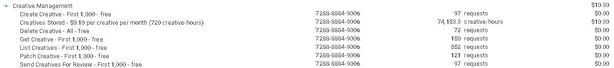

# Facturación de Ad Server

La sección de facturación del ad server está disponible en la página de facturación. Contiene información sobre cada elemento facturado relacionado con la publicación de anuncios y se divide en 9 subsecciones.

<figure><figcaption></figcaption></figure>


En BMS, se prioriza la transparencia mostrando todos los detalles de su factura. Visite nuestra [Página de Facturación](../billing.md) para comprender cómo están estructurados los proyectos de ley.


A continuación se ofrece una explicación de cada una de estas secciones con sus respectivos detalles.

### **Gestión de Anuncios** 

La subsección de gestión de anuncios detalla los costes asociados al proceso de gestión de anuncios. El almacenamiento de anuncios conlleva una tarifa basada en la duración del almacenamiento y el número de anuncios almacenados. Además, hay una cuota gratuita de 1000 solicitudes para cada uno de los siguientes servicios: creación de anuncios, solicitudes de anuncios, parcheo de anuncios y listado de anuncios. Se aplican cargos una vez que se supera esta cuota gratuita. Las acciones de eliminación no se cobran.&#x20;

<figure><figcaption>
Gestión de anuncios
</figcaption></figure>

_**Ejemplo:** En la imagen, se consumieron casi 63 000 horas de anuncios, lo que equivale a mantener activos casi 88 anuncios durante un mes (720 horas). Esto da como resultado una factura de 8,80 $. Además, hubo casi 73 000 solicitudes de anuncios; las primeras mil fueron gratuitas y, a partir de ahí, las solicitudes de anuncios se facturaron a 0,01 $ por cada mil, lo que dio como resultado una factura de 0,73 $. Por lo tanto, la factura total de gestión publicitaria (8,80 $ + 0,73 $) fue de 9,52 $._&#x20;

### **Representación de anuncios** 

La subsección sobre la representación de anuncios detalla los costes asociados al servicio de representación de anuncios. Se cuenta una representación cada vez que se muestra un anuncio en una pantalla, ya sea a un usuario o en una vista previa durante el proceso de creación. Se le cobrará por cada solicitud al recuperar un contenedor de anuncios o contenido publicitario. Además, los cargos por la representación de un anuncio se basarán en el número de bytes de contenido publicitario transferidos durante el proceso.

<figure><figcaption>
Representación de anuncios
</figcaption></figure>

_**Ejemplo:** Observará que en esta imagen hubo casi 103 000 solicitudes de contenido publicitario. El cargo fue de 0,10 $ por cada 1000 solicitudes de contenido publicitario, lo que dio lugar a una factura de 10,27 $. También se puede observar que se transfirieron 0,57 GB de datos de contenido publicitario. El cargo fue de 1,00 $ por GB transferido, lo que supuso un coste de 0,57 $ por los datos de contenido publicitario transferidos. Dado que el contenedor publicitario solo tiene 56 solicitudes y se cobra 0,01 $ por cada 1000 solicitudes, no contribuyó al resultado final, lo que significa que la factura total por la visualización de anuncios (10,27 $ + 0,57 $) fue de 10,84 $._

### **Seguimiento de anuncios** 

En esta subsección se describen los costes asociados al servicio de seguimiento de anuncios. Cada acción seguida cuenta como una solicitud, incluidas las realizadas durante el proceso de creación. Todos los servicios de esta sección incluyen una cuota gratuita de 1000 solicitudes, y solo se aplicarán cargos una vez que se supere esta cuota. Las tarifas se basan en el número total de solicitudes procesadas durante su campaña publicitaria.&#x20;

<figure><figcaption>
Seguimiento de anuncios
</figcaption></figure>

_**Ejemplo:** En la imagen, se puede observar que había una cuota gratuita de 1000 solicitudes por servicio, tras la cual se inicia la facturación. Cabe destacar que esta cuota no se alcanzó para el servicio de seguimiento de clics en anuncios, lo que significa que no se aplicarán cargos por este servicio. También se puede observar que, tras alcanzar la cuota, el servicio de seguimiento de visualizaciones de anuncios se cobra a 0,001 $ por cada 1000 solicitudes. Hubo casi 93 000 solicitudes para este servicio, lo que dio lugar a una factura de 0,09 $. Además, después de que el seguimiento de visualizaciones de anuncios superara la marca de las 1000 solicitudes, se cobraron casi 48 000 solicitudes, lo que dio lugar a una factura de 0,05 $, alcanzando una factura total por seguimiento de anuncios de 0,14 $._&#x20;

### **Gestión de Blueprints en Creative Builder**

La subsección Gestión de Blueprints en Creative Builder detalla los costes relacionados con el proceso de gestión de planos. El almacenamiento de los planos se cobra en función del número de planos que tenga y del tiempo que permanezcan almacenados. Hay una cuota gratuita de 1000 solicitudes disponible para los demás servicios de esta subsección, tras la cual se le cobrará por cada solicitud.

<figure><figcaption>
Gestión de Blueprints en Creative Builder
</figcaption></figure>

_**Ejemplo:** Como se puede observar en la imagen, excepto el almacenamiento, todos los demás servicios tienen una cuota gratuita de 1000 solicitudes. Dado que ninguno de ellos ha alcanzado la cuota, no se aplicarán cargos relacionados con ellos. En cuanto al almacenamiento, se facturó a 0,01 $ por plano al mes (720 horas). Se consumieron casi 1300 horas de planos en un mes, lo que equivale a mantener 2 planos almacenados durante un mes, lo que da como resultado una factura de 0,02 $ por almacenamiento._&#x20;

### **Gestión de Builds en Creative Builder**

En esta subsección se detallan los costes relacionados con el proceso de gestión de compilaciones. Hay una cuota gratuita de 1000 solicitudes para todos los servicios enumerados, excepto el almacenamiento. Una vez superada esta cuota, se le cobrará por cada solicitud. El almacenamiento se cobra en función del número de compilaciones que haya almacenado y de la duración del almacenamiento en la plataforma. Las acciones de eliminación no se cobran.&#x20;

<figure><figcaption>
Gestión de Builds en Creative Builder
</figcaption></figure>

_**Ejemplo:** Observará que en esta imagen, excepto por el almacenamiento, no se aplicaron cargos, ya que los servicios enumerados tenían una cuota gratuita de 1000 solicitudes, que no se superó. El almacenamiento se cobró a 0,01 $ por compilación al mes (720 horas). Se consumieron casi 5000 horas de compilación, lo que equivale a mantener almacenadas casi 7 compilaciones durante un mes, lo que dio lugar a una factura de 0,07 $._&#x20;

### **Gestión creativa de grupos**

La subsección Gestión de grupos creativos describe los costes asociados a la gestión de grupos creativos. Las acciones de eliminación no conllevan ningún coste. Cada servicio ofrece una cuota gratuita de 1000 solicitudes, excepto el almacenamiento. Una vez superada la cuota gratuita, se aplican cargos por solicitud. Los costes de almacenamiento se basan en el número de grupos creativos almacenados en la plataforma y la duración de su almacenamiento.&#x20;

<figure><figcaption>
Gestión creativa de grupos
</figcaption></figure>

_**Ejemplo:**_ _En esta imagen, observará que había una cuota gratuita de 1000 solicitudes para cada servicio, excepto para el almacenamiento. Dado que no se superó la cuota para estos servicios, no se aplicarán cargos. El almacenamiento se facturó a 0,10 $ por grupo creativo al mes (720 horas). Se consumieron casi 60 000 horas de grupo creativo, lo que dio lugar a una factura de 8,39 $, lo que equivale a casi 84 grupos creativos almacenados durante un mes (720 horas)._&#x20;

### **Gestión creativa**

Esta subsección proporciona detalles sobre los costes asociados a la gestión creativa. Las acciones de eliminación son gratuitas. Cada servicio, excepto el almacenamiento, incluye una cuota gratuita de 1000 solicitudes; se aplican cargos por cada solicitud que supere este límite. Los costes de almacenamiento se basan en el número de creatividades y la duración de su almacenamiento en la plataforma.&#x20;

<figure><figcaption>
Gestión creativa
</figcaption></figure>

_**Ejemplo:** En la imagen, se puede observar que había una cuota gratuita de 1000 solicitudes por servicio, excepto para el almacenamiento. Dado que ninguno de estos servicios superó la cuota, no se aplicarán cargos. El almacenamiento se facturó a 0,10 $ por creatividad al mes (720 horas). Con un poco más de 74 000 horas de creatividad consumidas, la factura resultante es de 10,30 $, lo que equivale a almacenar casi 103 creatividades durante un mes (720 horas)._&#x20;

### **Gestión de dominios**

Esta subsección contiene información de facturación relacionada con el proceso de gestión de dominios. Existe una cuota gratuita de 1000 solicitudes para el servicio de listado de dominios, tras la cual se aplicarán cargos por cada solicitud.

<figure><figcaption>
Gestión de dominios
</figcaption></figure>

_**Ejemplo:** En la imagen se puede observar que el único servicio utilizado fue el listado de dominios, que tenía una cuota gratuita de 1000 solicitudes. Dado que no se superó la cuota, no se aplicarán cargos._

### Gestión de revisiones de Exchange

La subsección de gestión de revisiones de Exchange contiene información de facturación relacionada con el proceso de revisión de Exchange, incluida la actualización del estado de la revisión de Exchange y el envío de un anuncio para la revisión de Exchange. Cada uno se cobrará por solicitud después de superar la cuota gratuita de 1000 solicitudes por servicio.

<figure><figcaption>
Gestión de revisiones de Exchange
</figcaption></figure>

_**Ejemplo:** En esta imagen, observará que había una cuota gratuita de 1000 solicitudes para actualizar el estado de revisión del Exchange. Tras superar esta cuota, se facturó al servicio 0,01 $ por cada 1000 solicitudes. Con casi 15 000 solicitudes realizadas, la factura resultante es de 0,15 $. El otro servicio no superó la cuota gratuita, por lo que no se aplicarán cargos por él._


Todos los productos generan métricas una vez que se empiezan a utilizar. Estas métricas se cobran y son cruciales para comprender el uso y el rendimiento de su plataforma BMS. El [Pestaña de monitoreo](../monitoring/monitoring-billing.md#metric-monitoring) es responsable de estas métricas y mostrará la factura correspondiente.\
BMS se centra en la transparencia y le mostrará los costes de todas las funciones de cada producto.

