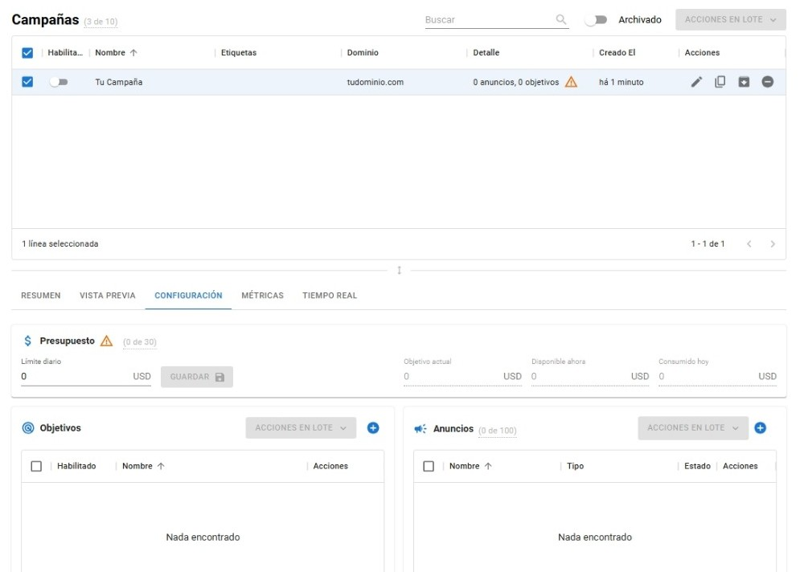
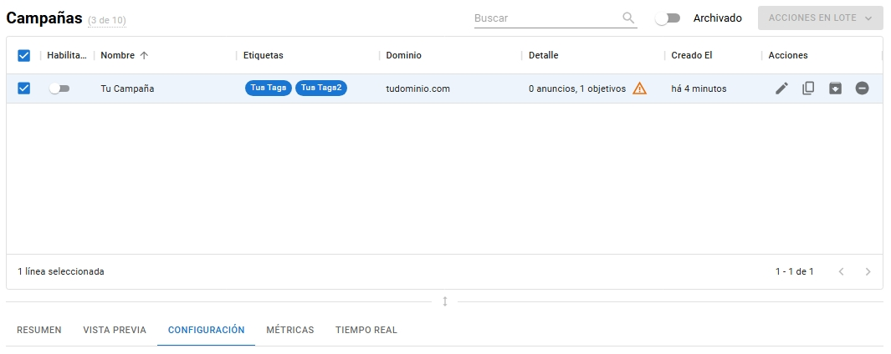
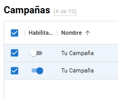
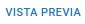
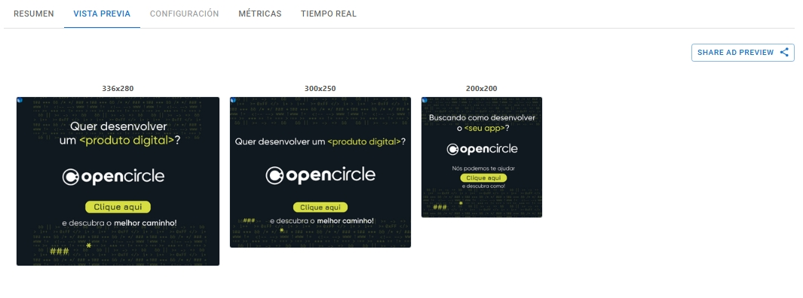
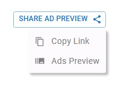

# Gestión de Campañas

### Creación de una campaña

En el área de campañas, haga clic en .

Rellene los datos.

<figure><figcaption>
Creación de la Campaña
</figcaption></figure>

* Nombre - Elige un nombre para tu campaña;
* Etiquetas - Hasta 5 etiquetas que se pueden utilizar para facilitar la identificación y la búsqueda;
* Dominio - Es el dominio principal al que llevará al usuario esta campaña cuando haga clic en ella;
* Zona horaria - La zona horaria en la que desea que se publique su campaña;
* Programación - Establezca la fecha de inicio y finalización de la campaña;
* Precio de puja - Aquí es donde decidirá el precio de puja para la subasta del anuncio;
  * Fijo: Establece un precio fijo para un espacio de inventario.
  * Variable: Active esta opción para utilizar nuestra tecnología **"Bid Shading"**, que es el propio pujador de la plataforma; si se activa, optimizará su gasto presupuestario, centrándose siempre en el valor más justo para la compra de esos espacios de inventario. Esto genera un ahorro significativo, aunque la empresa puede optar por no activar Bid Shading y dejar que la oferta de puja se base únicamente en el objetivo de CPM.&#x20;
* Límite de frecuencia: Cantidad de impresiones por dispositivo. Aquí puede cambiar cuántas veces se mostrará la campaña en cada dispositivo;


_¡Atención! Cuanto mayor sea el límite de frecuencia, más aparecerás ante el mismo usuario. Cuanto menor sea el límite de frecuencia, llegarás a más usuarios y aparecerás con menos frecuencia ante cada uno de ellos._


Después de rellenar todos los campos, haga clic en .png>) si hay algún campo no válido, se mostrará para que puedas revisar lo que falta.

Esta será la vista que verás después de crear correctamente una campaña.

<figure><figcaption>
Lista de Campañas
</figcaption></figure>

### Configuración de su campaña

Para comenzar a configurar tu campaña, comprueba el  de la campaña deseada y se mostrará la pestaña de configuración correspondiente.

<figure><figcaption>
Configuración de su campaña
</figcaption></figure>

Configure su [Presupuestos](budgets.md), [Objetivos](targets.md) y [Anuncios](managing-ads.md).

### Habilitar tu campaña

Para habilitar tu campaña, **debes** tener al menos un objetivo y un anuncio añadidos a la campaña. También puedes consultar el  inicie sesión para comprobar si hay algún problema que le impida habilitar la campaña.


_Si este aviso aparece en el estado de su creatividad, anuncio o campaña, significa que el material no ha sido aprobado por la plataforma o los intercambios publicitarios. En este caso, BMS le informará del problema en cuestión (en detalle) al pasar el cursor por encima del signo, y usted podrá realizar los ajustes necesarios antes de la activación._


<figure><figcaption>
Campaña
</figcaption></figure>

Para habilitar tu campaña, simplemente activa el botón "Habilitar".

<figure><figcaption>
Campaña Habilitada
</figcaption></figure>

### Compartir Preview del Ad 

Puedes previsualizar tu anuncio y compartir el enlace de vista previa con tus clientes. Con esta función, ellos pueden acceder y ver los anuncios que se están ejecutando en BMS sin necesidad de iniciar sesión en la plataforma. Esto mejora el proceso de revisión, garantiza una mayor transparencia y mantiene a todos alineados con las actualizaciones en los creativos. Además, permite a los clientes evaluar los anuncios desde cualquier lugar, en cualquier momento.


Ten en cuenta que esta función solo está disponible dentro del área de DSP, en la sección de Campañas.


Para previsualizar tu anuncio, selecciona una o más campañas y luego haz clic en .

<figure><figcaption>
Vista Previa
</figcaption></figure>

Para compartir la vista previa de tu anuncio, haz clic en  (2).png>), y luego selecciona “Copy Link” para copiar el enlace que deseas enviar a tu cliente.

<figure><figcaption>
Compartir Preview del Ad
</figcaption></figure>

Al seleccionar "Ads Preview", puedes ver exactamente cómo el cliente verá los anuncios usando el enlace antes de enviarlo.

<figure><figcaption>
Vista previa de anuncios
</figcaption></figure>

### Duplicar tu campaña

Si desea reutilizar una campaña con diferentes configuraciones sin tener que crear una nueva desde cero, tiene la opción de duplicar una campaña, simplemente haga clic en  en la campaña que desea duplicar aparecerá una copia de dicha campaña. Al duplicar una campaña, también se duplican los anuncios, el presupuesto y los objetivos.

### Archivar y desarchivar tu campaña

Si una campaña ha cumplido su propósito pero no desea eliminarla, tiene la opción de archivarla. Haga clic en  para archivar.

Para consultar tus campañas archivadas, haz clic en  para cambiar la vista a campañas archivadas, allí las verá todas y, si desea recuperar una campaña, simplemente haga clic en  (1) (1).png>) y la campaña volverá a estar disponible.

### Eliminar una campaña

Si necesita eliminar una campaña, simplemente haga clic en  (1) (1).png>) y aparecerá una pantalla de confirmación. Esta acción no se puede deshacer y tendrás que escribir manualmente el nombre de la campaña para eliminarla.

<figure><figcaption>
Pantalla de Eliminación de Campaña
</figcaption></figure>


_¡Atención! Siempre recomendamos desactivar la campaña en lugar de eliminarla por completo. Al eliminar una campaña, también se pierden todos los datos y métricas._


### Pestaña Métricas

Aunque los eventos en tiempo real se conservan durante 15 minutos, puedes consultar las métricas de la campaña para cualquier intervalo de tiempo. Las métricas pueden tardar hasta 5 minutos en mostrar los datos más recientes. A continuación encontrarás todas las métricas disponibles para tu campaña.

* [Campaña Activa](dsp-metrics.md#campaign-active)
* [Presupuesto Gastado](dsp-metrics.md#budget-spent)
* [Pujas y Tasa de Pujas Ganadas](dsp-metrics.md#bids-and-bid-win)
* [Impresiones](dsp-metrics.md#impressions)
* [Precio por Impresión](dsp-metrics.md#impression-price)
* [CPM](dsp-metrics.md#cpm)
* [CPC](dsp-metrics.md#cpc)
* [Entregas y Tasa de Entrega](../ad-server/ad-server-metrics.md#deliveries-and-delivery-rate)
* [Visualizaciones y Tasa de Visualización](../ad-server/ad-server-metrics.md#displays-and-display-rate)
* [Vistas](../ad-server/ad-server-metrics.md#views)
* [Visibilidad](../ad-server/ad-server-metrics.md#viewability)
* [Visibilidad y Duración de la Visibilidad](../ad-server/ad-server-metrics.md#viewability-and-visibility-duration)
* [Clics y CTR](../ad-server/ad-server-metrics.md#clicks-and-ctr)
* [Tasa de Clic a Carga de Página](../ad-server/ad-server-metrics.md#click-to-page-load-rate)
* [Costo por Carga de Página](dsp-metrics.md#cost-per-page-load)
* [Tiempo hasta la Visualización](../ad-server/ad-server-metrics.md#time-to-display)
* [Tiempo hasta la Vista](../ad-server/ad-server-metrics.md#time-to-view)
* [Tiempo hasta el Clic](../ad-server/ad-server-metrics.md#time-to-click)
* [Tiempo de Carga de la Página](../ad-server/ad-server-metrics.md#time-to-page-load)
* [Cargas de Página](../ad-server/ad-server-metrics.md#page-loads)
* [Tasa de Carga de Página](../ad-server/ad-server-metrics.md#page-load-rate)
* [Objetivo de Precio de Puja](dsp-metrics.md#bid-price-target)
* [Precio de Puja Efectivo](dsp-metrics.md#bid-price-effective)
* [Recuento de Dispositivos](dsp-metrics.md#device-count)
* [Frecuencia por Dispositivo](dsp-metrics.md#device-frequency)
* [Presupuesto Gastado con Recomendaciones](dsp-metrics.md#budget-spent-with-recommendations)
* [Presupuesto Gastado al Realizar Pujas](dsp-metrics.md#budget-spent-placing-bids)
* [Presupuesto Gastado en Impresiones](dsp-metrics.md#budget-spent-on-impressions)
* [Presupuesto Gastado en Entregas](dsp-metrics.md#budget-spent-on-deliveries)
* [Objetivo de Ritmo de Presupuesto](dsp-metrics.md#budget-pace-target)
* [Ritmo de Presupuesto Efectivo](dsp-metrics.md#budget-pace-effective)
* [Presupuesto Disponible](dsp-metrics.md#budget-available)
* [Límite de Presupuesto Diario](dsp-metrics.md#budget-daily-limit)
* [Pujas Rechazadas](dsp-metrics.md#rejected-bids)
* [Pujas Perdidas](dsp-metrics.md#losing-bids)
* [Precios de Pujas Perdidas](dsp-metrics.md#losing-bid-prices)
* [Precio Mínimo para Ganar](dsp-metrics.md#minimum-price-to-win)

También puede ver los eventos en tiempo real de su campaña a través de nuestra [Pestaña de Tiempo Real](real-time-tab.md).
