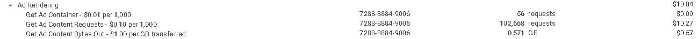
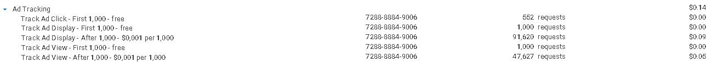
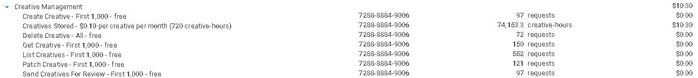
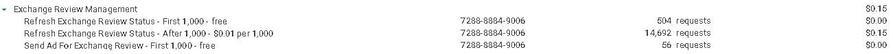

# Cobranças de Servidor de Anúncios

A seção de cobranças do servidor de anúncios está disponível na página de faturamento. Ela contém informações sobre cada item faturado relacionado à veiculação de anúncios e está dividida em 9 subseções.

<figure><figcaption></figcaption></figure>


Na BMS, priorizamos a transparência ao exibir cada detalhe de sua fatura. Visite nossa página de [Cobranças ](../billing.md)para entender como as faturas são estruturadas.


Abaixo está uma explicação de cada uma dessas seções com seus respectivos detalhes.

### Gerenciamento de Anúncios 

A subseção de gerenciamento de anúncios detalha os custos associados ao processo de gerenciamento de anúncios. O armazenamento de anúncios incorre em uma taxa baseada na duração do armazenamento e no número de anúncios armazenados. Além disso, há uma cota de cortesia de 1.000 requisições para cada um dos seguintes serviços: criação de anúncios, requisições de anúncios, atualização de anúncios e listagem de anúncios. As cobranças são aplicadas assim que essa cota gratuita é excedida. Ações de exclusão não são cobradas.

<figure><figcaption>
Gerenciamento de Anúncios
</figcaption></figure>

_**Exemplo**: Na imagem, houve quase 63 mil horas de anúncio consumidas, o que equivale a manter quase 88 anúncios ativos por um mês (720 horas). Isso resulta em uma fatura de $8,80. Além disso, houve quase 73 mil requisições de anúncios; as primeiras mil foram gratuitas e, depois disso, as requisições foram faturadas a $0,01 por mil, resultando em uma fatura de $0,73. Portanto, a fatura total de Gerenciamento de Anúncios ($8,80 + $0,73) foi de $9,52._

### Renderização de Anúncios 

A subseção de renderização de anúncios detalha os custos associados ao serviço de renderização de anúncios. Uma renderização é contada cada vez que um anúncio é exibido em uma tela, seja para um usuário ou em uma pré-visualização durante o processo de criação. Você será cobrado por requisição ao recuperar um contêiner de anúncio ou conteúdo de anúncio. Além disso, as cobranças pela renderização de um anúncio serão baseadas no número de bytes de conteúdo do anúncio transferidos durante o processo.

<figure><figcaption>
Renderização de Anúncios
</figcaption></figure>

_**Exemplo**: Você notará que nesta imagem houve quase 103 mil requisições de conteúdo de anúncio. A cobrança foi de $0,10 por 1.000 requisições, resultando em uma fatura de $10,27. Também é possível notar que 0,57 GB de dados de conteúdo de anúncio foram transferidos. A cobrança foi de $1,00 por GB transferido, custando $0,57 pelos dados transferidos. Como o contêiner de anúncio teve apenas 56 requisições e é cobrado a $0,01 por 1.000, ele não contribuiu para o resultado final, significando que a fatura total de Renderização de Anúncios ($10,27 + $0,57) foi de $10,84._

### Rastreamento de Anúncios 

Esta subseção descreve os custos associados ao serviço de rastreamento de anúncios. Cada ação rastreada conta como uma requisição, incluindo aquelas realizadas durante o processo de criação. Todo serviço nesta seção inclui uma cota gratuita de 1.000 requisições, e as cobranças só se aplicam quando essa cota é excedida. As taxas são baseadas no número total de requisições processadas durante sua campanha de anúncios.

<figure><figcaption>
Rastreamento de Anúncios
</figcaption></figure>

_**Exemplo**: Na imagem, você pode observar que havia uma cota gratuita de 1.000 requisições por serviço, após a qual a cobrança se inicia. É notável que essa cota não foi atingida para o serviço de Rastreamento de Cliques, o que significa que não haverá cobranças por este serviço. Você também pode observar que, após atingir a cota, o serviço de Rastreamento de Exibição é cobrado a $0,001 por 1.000 requisições. Houve quase 93 mil requisições para este serviço, resultando em uma fatura de $0,09. Adicionalmente, depois que o Rastreamento de Visualização passou da marca de 1.000 requisições, ele cobrou por quase 48 mil requisições, resultando em uma fatura de $0,05, atingindo uma fatura total de Rastreamento de Anúncios de $0,14._

### Gerenciamento de Blueprints do Construtor de Criativos 

A subseção de Gerenciamento de Blueprints detalha os custos relacionados ao processo de gerenciamento de _blueprints_. O armazenamento dos _blueprints_ é cobrado com base em quantos você tem e por quanto tempo eles foram armazenados. Há uma cota gratuita de 1.000 requisições disponível para os outros serviços nesta subseção, após a qual você será cobrado por requisição.

<figure><figcaption>
Gerenciamento de Blueprints do Construtor de Criativos
</figcaption></figure>

_**Exemplo**: Como você pode observar na imagem, exceto pelo armazenamento, todos os outros serviços têm uma cota gratuita de 1.000 requisições. Como nenhum deles atingiu a cota, não haverá cobranças relacionadas a eles. Em relação ao armazenamento, foi faturado a $0,01 por blueprint por mês (720 horas). Quase 1.300 horas de blueprint foram consumidas em um mês, o que equivale a manter 2 blueprints armazenados por um mês, resultando em uma fatura de $0,02 pelo armazenamento._

### Gerenciamento de Builds do Creative Builder 

Esta subseção detalha os custos relacionados ao processo de gerenciamento de _Builds_. Há uma cota gratuita de 1.000 requisições para todos os serviços listados, exceto armazenamento. Após exceder esta cota, você será cobrado por requisição. O armazenamento é cobrado com base no número de _builds_ que você armazenou e na duração do armazenamento na plataforma. Ações de exclusão não são cobradas.

<figure><figcaption>
Gerenciamento de Builds do Construtor de Criativos
</figcaption></figure>

_**Exemplo**: Você notará que nesta imagem, exceto pelo armazenamento, não houve cobranças, pois os serviços listados tinham uma cota gratuita de 1.000 requisições, que não foi excedida. O armazenamento foi cobrado a $0,01 por build por mês (720 horas). Quase 5.000 horas de build foram consumidas, o que equivale a manter quase 7 builds armazenados por um mês, resultando em uma fatura de $0,07._

### Gerenciamento de Grupos de Criativos 

A subseção de Gerenciamento de Grupos de Criativos descreve os custos associados ao gerenciamento de grupos de criativos. Ações de exclusão não incorrem em cobranças. Cada serviço oferece uma cota gratuita de 1.000 requisições, exceto armazenamento. Uma vez que a cota gratuita é excedida, as cobranças se aplicam por requisição. Os custos de armazenamento são baseados no número de grupos de criativos armazenados na plataforma e na duração de seu armazenamento.

<figure><figcaption>
Gerenciamento de Grupos de Criativos
</figcaption></figure>

_**Exemplo**: Nesta imagem, você notará que havia uma cota gratuita de 1.000 requisições para cada serviço, exceto armazenamento. Como a cota para esses serviços não foi excedida, não haverá cobranças. O armazenamento foi faturado a $0,10 por grupo de criativos por mês (720 horas). Quase 60.000 horas de grupo de criativos foram consumidas, resultando em uma fatura de $8,39, o que equivale a quase 84 grupos de criativos armazenados por um mês (720 horas)._

### Gerenciamento de Criativos 

Esta subseção fornece detalhes sobre os custos associados ao gerenciamento de criativos. Ações de exclusão são gratuitas. Cada serviço, exceto armazenamento, inclui uma cota gratuita de 1.000 requisições; as cobranças são aplicadas por requisição além deste limite. Os custos de armazenamento são baseados no número de criativos e na duração em que são armazenados na plataforma.

<figure><figcaption>
Gerenciamento de Criativos
</figcaption></figure>

_**Exemplo**: Na imagem, você pode observar que havia uma cota gratuita de 1.000 requisições por serviço, exceto armazenamento. Como nenhum desses serviços excedeu a cota, não haverá cobranças. O armazenamento foi faturado a $0,10 por criativo por mês (720 horas). Com um pouco mais de 74.000 horas de criativo consumidas, a fatura resultante é de $10,30, o que equivale a armazenar quase 103 criativos por um mês (720 horas)._

### Gerenciamento de Domínios 

Esta subseção contém informações de faturamento relacionadas ao processo de gerenciamento de domínios. Há uma cota gratuita de 1.000 requisições para o serviço de listagem de domínios, após a qual as cobranças serão aplicadas por requisição.

<figure><figcaption>
Gerenciamento de Domínios
</figcaption></figure>

_**Exemplo**: Você notará na imagem que o único serviço utilizado foi a listagem de domínios. Este serviço tinha uma cota gratuita de 1.000 requisições; como a cota não foi excedida, não haverá cobranças._

### Gerenciamento de Revisão de Exchange 

A subseção de gerenciamento de revisão de _exchange_ contém informações de faturamento relacionadas ao processo de revisão de _exchange_, incluindo a atualização do status da revisão e o envio de um anúncio para revisão. Cada um será cobrado por requisição após exceder a cota gratuita de 1.000 requisições por serviço.

<figure><figcaption>
Gerenciamento de Revisão de Exchange
</figcaption></figure>

_**Exemplo**: Nesta imagem, você notará que havia uma cota gratuita de 1.000 requisições para a atualização do status da revisão de exchange. Após exceder esta cota, o serviço foi faturado a $0,01 por 1.000 requisições. Com quase 15.000 requisições feitas, a fatura resultante é de $0,15. O outro serviço não excedeu a cota gratuita, então não haverá cobranças por ele._


Todos os produtos geram métricas assim que você começa a usá-los. Essas métricas são cobradas e são cruciais para entender o uso e o desempenho da sua plataforma BMS. A Aba de Monitoramento é responsável por essas métricas e exibirá a fatura relacionada.\
A BMS foca na transparência e mostrará a você os custos de todos os recursos dentro de cada produto.

