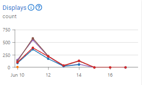
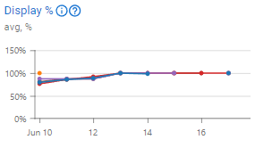
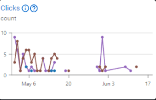
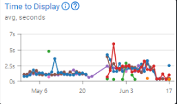

---
layout:
  width: default
  title:
    visible: true
  description:
    visible: false
  tableOfContents:
    visible: true
  outline:
    visible: true
  pagination:
    visible: true
  metadata:
    visible: true
---

# Métricas de Ad Server

Aqui você encontrará todas as métricas relacionadas ao nosso _Ad Server_ (Servidor de Anúncios). Elas aparecerão de acordo com cada recurso, ajudando você a entender o desempenho do recurso e fornecendo _insights_ valiosos para tomar decisões estratégicas em sua campanha. Além disso, ao revisar as métricas, você sempre pode usar o ícone  para acessar nossos artigos sobre uma métrica específica.


Você pode aprender mais sobre como as métricas são tratadas visitando a página de [Métricas](../metrics.md).


### Entregas e Taxa de Entrega 

Esta métrica representa o número de anúncios servidos pelo Ad Server, com base na solicitação de conteúdo feita pelo navegador do usuário final. Isso significa que seu anúncio estará no navegador do usuário.

<figure><figcaption>
Métrica de Entregas
</figcaption></figure> <figure><figcaption>
Métrica de Taxa de Entregas
</figcaption></figure>

_**Exemplo**: Neste gráfico, você pode ver que um pico de quase 700 entregas foi alcançado, com uma taxa média de entrega de 100%. Isso significa que seus anúncios estão sendo entregues ao público correto sem restrições em seu domínio. A métrica de Entrega está frequentemente relacionada à métrica de Impressões. Após vencer um leilão, seu anúncio será servido ao domínio. No entanto, se sua entrega não obtiver um resultado semelhante ao das impressões, isso pode ser causado pelas regras do domínio, que podem bloquear alguns tipos específicos de Anúncios._

### Exibições e Taxa de Exibição 

Esta métrica representa o número de anúncios exibidos em um navegador. Indica que o anúncio foi baixado e mostrado no navegador do usuário.

<figure><figcaption>
Métrica de Exibições
</figcaption></figure> <figure><figcaption>
Métrica de Taxa de Exibição
</figcaption></figure>

_**Exemplo**: Neste gráfico, você pode ver que um pico de quase 650 Exibições foi alcançado. Embora seus números de impressão sejam um pouco mais altos, a taxa de exibição não está atingindo 100%. Isso pode ser causado pelo anúncio não estar posicionado bem o suficiente, fazendo com que o usuário não veja o anúncio nem por uma fração de sua rotina de navegação. Fazer alterações no posicionamento e tornar o criativo mais atraente pode aumentar a taxa de exibição de seus anúncios._

### **Visualizações** 

Número de visualizações de acordo com as **Diretrizes do&#x20;**_**Media Ratings Counci**l_ (MRCG): 50% do anúncio deve estar na tela por pelo menos 1 segundo. Esta métrica só é validada quando o usuário atende aos requisitos do **MRCG**.

<figure><figcaption>
Métrica de Visualizações
</figcaption></figure>

_**Exemplo**: Neste gráfico, um pico de quase 400 Visualizações pode ser visto em 11 de junho. Se as visualizações estiverem próximas dos números de entrega e exibição, você pode analisar que seu Anúncio é atraente e está alcançando um resultado de branding, já que as pessoas estão efetivamente vendo seu anúncio. O anúncio deve ser exibido no navegador do usuário, e o usuário precisa ver pelo menos 50% do anúncio por pelo menos 1 segundo. Se apenas 40% do anúncio for mostrado, não contará como uma visualização._

### **V**isibilidade 

A proporção de visualizações em relação ao número total de entregas é uma métrica importante para medir se seus anúncios estão sendo vistos. Com base nisso, você pode precisar mudar a estratégia de sua campanha.

<figure><figcaption>
Métrica de Visibilidade
</figcaption></figure>

_**Exemplo**: Você pode ver neste gráfico que a campanha começou com uma visibilidade média de 50% a 80% e, após algumas mudanças, atingiu um pico de 100% de visibilidade. Se seus anúncios não estão sendo vistos, você pode precisar verificar seu criativo e fazer alterações, ou até mesmo mudar o posicionamento de seus anúncios para torná-los mais visíveis. Lembre-se de que mudar o posicionamento também pode aumentar o preço do leilão (bidding), pois o local se torna mais competitivo._

### Duração da Visibilidade e Duração da Exposição 

A duração da visibilidade representa a mediana de tempo, em segundos, que um anúncio permaneceu pelo menos 50% visível na tela, e a duração da exposição representa o tempo total que seus anúncios estiveram pelo menos 1% visíveis. Enquanto a duração da exposição rastreia o tempo total de exposição, a duração da visibilidade mede a qualidade da atenção. Combine os dados dessas métricas para entender a profundidade do seu engajamento, identificar fraudes ou mau posicionamento de anúncios e outros _insights_.

<figure><figcaption>
Métrica de Duração da Exposição
</figcaption></figure> <figure><figcaption>
Métrica de Duração da Visibilidade
</figcaption></figure>

_**Exemplo**: Estes gráficos exibem a duração da visibilidade e da exposição ao longo de 24 horas, segmentadas em intervalos de 6 horas. Às 00:00, a duração média da visibilidade foi um pouco acima de 20 segundos, o que significa que os anúncios entregues neste período permaneceram pelo menos 50% visíveis por uma média de 20 segundos. No mesmo período, a duração da exposição foi de 13 horas e 25 minutos. Considerando que esta campanha teve 8.300 entregas no mesmo período, uma mediana de visibilidade de 20s e uma exposição total de 13h25m mostram um forte engajamento — a maioria dos anúncios teve um tempo de tela significativo, evitando exposição fugaz e garantindo um amplo alcance. Nos intervalos seguintes, a duração caiu para 17 segundos, depois flutuou em torno de 10 segundos pelo restante do período, enquanto a exposição também caiu de 13h para 1h no último período._

### **C**liques e CTR 

Número de cliques. Se a estratégia da sua campanha é baseada em cliques, preste atenção a esta métrica e faça os ajustes necessários.

<figure><figcaption>
Métrica de <strong>C</strong>liques 
</figcaption></figure> <figure><figcaption>
Métrica de CTR
</figcaption></figure>

_**Exemplo**: Neste gráfico, você pode ver que um pico de quase 10 cliques foi alcançado em certos anúncios. Você pode revisar este gráfico para identificar quais anúncios não estão recebendo os cliques esperados e analisar como eles diferem dos anúncios que foram clicados. Você também deve considerar os públicos-alvo utilizados para entender em qual audiência seus anúncios estão performando melhor. Uma campanha baseada em Retargeting ou Remarketing foca em cliques para gerar conversões. Para alcançar isso, você precisa criar criativos atraentes e pode precisar alocar um orçamento maior para garantir um melhor posicionamento e segmentar públicos mais específicos._

### Tempo até a Exibição 

Esta métrica mede o tempo que o anúncio leva para carregar e ser exibido. Se o seu anúncio for muito pesado, ele pode encontrar dificuldades para carregar em dispositivos mais fracos ou conexões de internet mais lentas.

<figure><figcaption>
Métrica de Tempo até a Exibição
</figcaption></figure>

_**Exemplo**: Você pode ver neste gráfico que alguns anúncios estão levando, em média, mais de 3 segundos para carregar. Se o seu anúncio for mais pesado ou próximo de 2 MB, alguns usuários podem experienciar tempos de carregamento mais longos, resultando em atrasos antes que seu anúncio apareça. Isso pode impactar diretamente a visibilidade do seu anúncio, potencialmente fazendo com que os usuários não o vejam durante suas atividades de navegação. Otimizar seu criativo pode ajudar._

### Tempo até a Visualização 

Esta métrica mede o tempo que um usuário leva para visualizar o anúncio. Ao examinar esta métrica, você pode avaliar se são necessários ajustes no posicionamento do seu anúncio. Se os usuários estão demorando muito para ver seu anúncio, ele pode estar mal posicionado.

<figure><figcaption>
Métrica de Tempo até a Visualização
</figcaption></figure>

_**Exemplo**: Nesta métrica, você pode ver que no início da campanha, os anúncios estavam sendo visualizados muito mais rapidamente, em grande parte devido ao seu posicionamento. No entanto, após algumas mudanças, os anúncios estavam demorando significativamente mais do que o pretendido, muitas vezes ultrapassando 15 a 20 segundos adicionais. Um anúncio exibido no topo de uma página é muito mais visível do que um em um painel lateral, que pode exigir rolagem para ser visto. Como resultado, alterar o posicionamento do seu anúncio impactará diretamente o tempo que os usuários levam para visualizá-lo_

### **T**empo até o Clique 

Esta métrica mede o tempo que um usuário leva para clicar no anúncio. Se os usuários demoram muito para clicar, isso pode indicar que o anúncio está mal posicionado ou não é tão atraente quanto o esperado. Considere fazer alterações para aumentar a atratividade do seu anúncio ou ajustar seu posicionamento.

<figure><figcaption>
Métrica de <strong>T</strong>empo até o Clique
</figcaption></figure>

_**Exemplo**: Nesta métrica, você pode observar que, em média, os usuários levam 1 minuto e 30 segundos antes de clicar em um anúncio. Se o anúncio está demorando muito para ser clicado, você deve prestar atenção à qualidade do seu criativo. Pode ser melhor identificar áreas para melhoria. Além disso, você também pode usar Testes A/B para avaliar o desempenho de cada Anúncio e fazer múltiplas melhorias em cada teste para chegar a uma versão final desse criativo que obtenha mais resultados. Continue monitorando seus anúncios e faça ajustes constantes._

### Tempo para Carregamento da Página 

Esta métrica mostra uma mediana em segundos de quanto tempo foi necessário até que a página do seu site fosse totalmente carregada.

<figure><figcaption>
Métrica de Tempo para Carregamento da Página
</figcaption></figure>

_**Exemplo**: Estas métricas fornecem informações sobre quanto tempo leva até que sua página carregue. Você pode usar esses dados para melhorar seus anúncios e seu site para serem mais rápidos, o que pode melhorar sua taxa de retenção. Nesta imagem, o período de tempo definido foi de 3 dias, dividido em períodos de 6 horas. Você notará que em 21 de agosto, o tempo para carregar a página foi de quase 10 segundos; depois disso, esse tempo foi reduzido para quase 5 segundos e, em seguida, aumentou para um pouco mais de 10 segundos em 23 de agosto_

### Carregamentos de Página 

Esta métrica exibe o número de carregamentos de página que você teve no período de tempo definido. O número de cliques e carregamentos de página pode ser diferente porque os cliques passam por um filtro antifraude. Um clique pode ser sinalizado como suspeito e não ser contado; no entanto, se a página carregar até 15 minutos após a entrega do anúncio, o carregamento da página será contado.

<figure><figcaption>
Métrica de Carregamentos de Página
</figcaption></figure>

_**Exemplo**: Esta é uma maneira mais precisa de contar quantos usuários visitaram sua página clicando em seus anúncios; o usuário só será contado após carregar sua página completamente. Nesta imagem, o período de tempo definido foi de 3 dias, dividido em períodos de 6 horas. Você notará que em 21 de agosto houve quase 25 carregamentos de página e quase 5 carregamentos de página em 23 de agosto._

### Taxa de Carregamento de Página (%) 

Esta métrica mostra a proporção de páginas carregadas em relação à entrega de anúncios, o que significa que ela mostra, em porcentagem, quantas das suas entregas de anúncios resultaram em um carregamento de página.

<figure><figcaption>
Métrica de Taxa de Carregamento de Página (%)
</figcaption></figure>

_**Exemplo**: Em um contexto onde você instala a tag de rastreamento de carregamento de página em seu site, você poderá acompanhar nesta métrica quantas de suas entregas de anúncios resultaram em usuários acessando seu site. Nesta imagem, o período definido foi de 3 dias, dividido em períodos de 6 horas. Você notará que em 21 de agosto, quase 0,75% das entregas de anúncios resultaram em um carregamento de página, e depois disso, em 23 de agosto, a taxa de carregamento de página foi de quase 0,25%._

### Taxa de Clique para Carregamento de Página 

Esta métrica exibe, em porcentagem, a proporção entre o número de cliques и o número de carregamentos de página no período de tempo definido.

<figure><figcaption>
Métrica de Taxa de Clique para Carregamento de Página
</figcaption></figure>

_**Exemplo**: Os dados fornecidos por esta métrica mostrarão quantos cliques em seus anúncios resultaram em um carregamento de página. Nesta imagem, o período definido foi de 1 dia, dividido em períodos de 6 horas. Você notará que às 6h da manhã a taxa de clique para carregamento de página foi de quase 80%, o que significa que 20% dos cliques não resultaram em um carregamento de página. Do meio-dia às 18h, a taxa foi de quase 60%, e depois aumentou à meia-noite para 100%, o que significa que cada clique no anúncio resultou em um carregamento de página._
