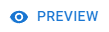

# Criativos

Criativos são a menor unidade de construção do nosso Ad Server, representando o que será entregue ao usuário final quando seu anúncio for exibido.

Os Criativos de Display são, essencialmente, blocos de código HTML. Você pode fornecer este código ou utilizar nosso editor integrado para configurar um criativo simples que contenha uma imagem clicável.

## Gerenciando Criativos 

<figure><figcaption>
Lista de Criativos
</figcaption></figure>

## Criando um Criativo 

Para começar a criação de um criativo, clique em .

Preencha as informações solicitadas:

<figure><figcaption></figcaption></figure>

* Nome - Como deseja nomear o criativo;
* Tags - até 5 rótulos que podem ser usados para auxiliar na identificação e busca;
* Domínio - o domínio principal para o qual este criativo direcionará o usuário ao ser clicado;
* Tipo- o tipo do criativo, como tamanhos IAB comuns, por exemplo, "Large Leaderboard (970x90)", "Banner (468x60)", etc.

Após clicar no menu suspenso disponível para selecionar um tipo de criativo, você terá acesso a uma lista contendo todos os tipos que podem ser usados. Estes são os tipos disponíveis:

<table data-header-hidden><thead><tr><th width="396"></th><th></th></tr></thead><tbody><tr><td>Super Leaderboard / Pushdown (970x90)</td><td>Medium Rectangle (300x250)</td></tr><tr><td>Leaderboard (728x90)</td><td>Large Rectangle (336x280)</td></tr><tr><td>Banner (468x60)</td><td>Small Square (200x200)</td></tr><tr><td>Smartphone Leaderboard (320x50)</td><td>Square (250x250)</td></tr><tr><td>Smartphone Banner (300x50)</td><td>Mobile Phone Interstitial (640x1136)</td></tr><tr><td>Feature Phone Small Banner (120x20)</td><td>Mobile Phone Interstitial (1080x1920)</td></tr><tr><td>Feature Phone Medium Banner (168x28)</td><td>Mobile Phone Interstitial (750x1334)</td></tr><tr><td>Feature Phone Large Banner (216x36)</td><td>Half-Page (300x600)</td></tr><tr><td>Billboard (970x250)</td><td>Portrait (300x1050)</td></tr><tr><td>Smartphone Large Leaderboard (320x100)</td><td>Wide Skyscraper (160x600)</td></tr><tr><td>Financial (120x60)</td><td>Skyscraper (120x600)</td></tr></tbody></table>

Para projetar seu criativo, você tem duas opções:

### Imagem Estática 

* Para usar uma imagem simples com um link, na aba "Imagem Estática", preencha:
  * A imagem que você deseja exibir. Você pode colar a URL de uma imagem que já está hospedando ou usar a integração com a Biblioteca de Mídia da BMS para encontrar ou carregar uma nova.
    * **Nota**: A Biblioteca de Mídia da BMS suporta o upload de imagens estáticas ou GIFs, desde que o tamanho do arquivo seja de 2 MB ou menos
  * O link que você deseja abrir quando a imagem for clicada. Pode ser qualquer URL HTTPS com query strings, como UTMs. Nosso rastreador de cliques padrão será adicionado para exibir as métricas do criativo.

#### Editando UTMs 

Ao inserir o link para o site designado ao seu criativo, é importante definir suas tags UTM. Se você não tiver suas tags pré-criadas, pode usar a funcionalidade  para fazer ajustes na sua URL e verificar uma pré-visualização em tempo real para validar sua URL. Este botão pode ser encontrado no espaço chamado "Link para". Após clicar no botão, a tela de configuração de tags UTM aparecerá.

<figure><figcaption>
Editor de UTM
</figcaption></figure>

Você verá a URL do seu site atual e, em seguida, cada tag UTM e sua explicação para ajudá-lo a preenchê-las.


Se nenhuma URL tiver sido informada, você precisará inserir a URL correspondente ao domínio do seu site; se nenhuma URL for apresentada, não será possível configurar suas UTMs.


Ao editar as UTMs, cada vez que você alterar uma tag, sua URL de Link será atualizada automaticamente, apresentando a versão atual de suas tags.

*   **Fonte UTM:** Identifica a origem do tráfego. Neste caso, você usaria "BMS" como sua origem..&#x20;

    * _**Exemplo** - "**BMS**": Para saber que o criativo veio da plataforma BMS._

    **Nota**: Você pode adicionar qualquer tipo de origem à sua UTM, a decisão de qual é a melhor é sua.
* **Meio UTM:** Você pode usar um meio de campanha para identificar o meio pelo qual um visitante encontrou sua URL, como mídias sociais, código QR, custo por clique (CPC), afiliados, anúncios orgânicos/pagos, newsletters, etc.
  * _**Exemplo** - "**Social**": Como a campanha terá como alvo as mídias sociais, podemos definir o meio como Social._
* **Campanha UTM:** Como o nome sugere, é usado para dar um nome à sua campanha, como "Promoção Black Friday", "Promoção de Ação de Graças", "Campanha de Lançamento", etc
  * _**Exemplo** - "**SuaCampanha**": Aqui você pode simplesmente indicar o nome da sua campanha para identificar melhor a campanha em que o criativo está sendo usado._
* **Conteúdo UTM:** O conteúdo da campanha é útil quando você está fazendo testes A/B com anúncios. Ele diferencia links idênticos que direcionam para a mesma URL. Por exemplo, quando você tem dois links em um e-mail, este parâmetro os distingue.
  * _**Exemplo** - "**PaginaInicial**": O conteúdo que será apresentado ao usuário. Se estivermos rodando testes A/B em páginas diferentes, esta é uma forma de configurar a tag UTM de conteúdo._
* **Termo UTM:** Identifica palavras-chave pagas em campanhas de anúncios (usado principalmente para campanhas de busca paga).
  * _**Exemplo** - "**TenisEsportivo**": Isso identifica a campanha de busca paga na qual as palavras-chave usadas para a busca paga foram "Tênis Esportivo"._

Depois de configurar todas as suas Tags UTM, clique no botão  e suas tags serão configuradas adequadamente.

<figure><figcaption>
UTM Tags Configuradas
</figcaption></figure>

### Colar HTML 

Para usar um criativo totalmente personalizado, mude para a aba "Colar HTML" e insira o código HTML final que será exibido quando o usuário visualizar seu criativo.


Atenção! Mais adiante nesta seção, você encontrará algumas macros. Você deve usá-las para habilitar o rastreamento de cliques da BMS em seus anúncios; caso contrário, os cliques **não serão rastreados**.


<figure><figcaption>
Exemplo de Customização HTML
</figcaption></figure>

Isso pode ser qualquer coisa, e é inteiramente sua responsabilidade produzir um criativo funcional com HTML, CSS e Javascript.

Quando você fornece o código HTML, nosso rastreador de cliques não será adicionado automaticamente. Você pode copiar a macro de rastreamento de cliques (ou qualquer outra macro que desejar) dos botões de assistência de template na parte inferior e colá-la em seu HTML. Para mais informações, por favor, dê uma olhada na [seção de Macros](creatives.md#macros).

Você pode usar o botão  para ver como seu criativo será exibido e para garantir que ele direcione os usuários para o site correto quando clicado.

Se estiver pronto para enviar o criativo para revisão, certifique-se de que a opção "Enviar para revisão" esteja marcada. Se desejar continuar editando mais tarde, deixe-a desmarcada.

Após fazer todos os ajustes necessários, clique em .png>).

#### Macros

Nosso Ad Server fornece várias macros que podem ser usadas dentro do seu código HTML. Elas podem ser encontradas na parte inferior da aba "Colar HTML".

<figure><figcaption>
Seção de Macros Disponíveis
</figcaption></figure>

Algumas delas são:

* **Rastreadores de Clique da BMS** - Estas macros permitirão que a BMS rastreie cliques em seus anúncios. Se você não instalar nenhuma delas, nenhum evento ou métrica de clique será registrado.
  * **URL de Clique Sem Escape (**_**Unescaped Click URL**_**)**\
    Esta é a versão mais utilizada. Deve ser instalada no início do link, antes de qualquer outro rastreador e antes da própria URL final.
  * **URL de Clique Com Escape (Escaped Click URL)**\
    Esta versão é semelhante à anterior, mas só deve ser usada se você desejar ter um rastreador de cliques externo que não suporte URLs sem escape.
  * **URL de Clique com Duplo Escape (**_**Double-escaped Click URL**_**)**\
    Esta versão é semelhante às duas anteriores, mas só deve ser usada se você desejar ter uma cadeia de rastreadores de cliques de dois ou mais, onde os rastreadores externos não suportam URLs sem escape.
  * **Quebrador de Cache (**_**Cache Buster**_**)**\
    Esta macro injetará uma sequência aleatória de números e é mais comumente usada para garantir que as solicitações não sejam armazenadas em cache.

### Revisão de Criativos 

Ao finalizar a criação do seu criativo, ele será enviado para revisão a fim de identificar se o conteúdo é adequado. Abaixo, você encontra alguns status que podem ser exibidos para o seu criativo.

* **Na Fila**: O criativo está na fila de revisão.
* **Em Andamento**: A plataforma ainda está revisando o criativo.
* **Aprovado**: O criativo foi aprovado sem restrições.
* **Aprovado Parcialmente**: O criativo foi aprovado com restrições (regiões ou plataformas específicas).
* **Rejeitado**: O criativo foi rejeitado e não pode ser usado.
* **Revogado**: O criativo foi aprovado anteriormente, mas teve sua aprovação revogada.
* **Ignorado**: O processo de revisão foi pulado e não executado.

Se você tiver alguma dúvida sobre o resultado do status de revisão do seu criativo, entre em contato com nossa equipe de suporte.

### Editando um Criativo 

Para editar um criativo, use o botão  no criativo correspondente. Todos os campos estão disponíveis para edição, exceto os seletores de domínio e tipo.

<figure><figcaption>
Editando um Criativo
</figcaption></figure>

Se você modificar a URL da imagem, o link ou o código HTML, o criativo voltará ao status de **Rascunho**, e você precisará enviar o criativo para revisão novamente. Enquanto estiver em rascunho, o criativo não será exibido em nenhuma campanha

Depois de ter feito todas as alterações necessárias em seu criativo, clique em .png>).

### Habilitando e Desabilitando um Criativo 

.png>)

Para ser exibido em uma campanha, um criativo deve estar habilitado. Se desejar impedir que um criativo seja exibido, você pode desabilitá-lo, e ele cessará as impressões imediatamente.

### Arquivando e Desarquivando um Criativo 

Criativos que não estão sendo usados com frequência podem ser arquivados clicando no botão . Arquivar um criativo não impede que ele seja usado ou exibido; simplesmente o oculta da visualização principal.

Para ver todos os criativos arquivados, basta ativar o filtro . Você pode desarquivar um criativo  para retorná-lo à lista principal.

### Excluindo um Criativo 

Você pode excluir um criativo clicando em . Se o criativo estiver em uso, você verá uma lista dos grupos de criativos que serão afetados. Se você confirmar a exclusão, os grupos de criativos serão modificados para remover o criativo excluído da rotação.

<figure><figcaption>
Confirmação de exclusão de criativo mostrando criativos em uso
</figcaption></figure>


Atenção! Se você excluir um criativo, todos os dados relacionados a ele, incluindo métricas coletadas anteriormente, também serão excluídos. Esta ação não pode ser desfeita.


## Monitorando Criativos 

### Aba de Métricas 

A aba de métricas exibirá todas as métricas relacionadas aos criativos selecionados ou para toda a conta, se nenhum criativo for selecionado. Encontre abaixo todas as métricas disponíveis para seus criativos:

* [Entregas](ad-server-metrics.md#deliveries-and-delivery-rate)
* [Exibições e Taxa de Exibição](ad-server-metrics.md#exibicoes-e-taxa-de-exibicao)
* [Visualizações](ad-server-metrics.md#visualizacoes)
* [Visibilidade](ad-server-metrics.md#visibilidade)
* [Cliques e CTR](ad-server-metrics.md#cliques-e-ctr)
* [Taxa de Clique para Carregamento de Página](ad-server-metrics.md#taxa-de-clique-para-carregamento-de-pagina)
* [Tempo até a Exibição](ad-server-metrics.md#tempo-ate-a-exibicao)
* [Tempo até a Visualização](ad-server-metrics.md#tempo-ate-a-visualizacao)
* [Tempo até o Clique](ad-server-metrics.md#tempo-ate-o-clique)
* [Tempo para Carregamento de Página](ad-server-metrics.md#tempo-para-carregamento-da-pagina)
* [Carregamentos de Página](ad-server-metrics.md#carregamentos-de-pagina)
* [Taxa de Carregamento de Página](ad-server-metrics.md#taxa-de-carregamento-de-pagina)

### Aba de Tempo Real 

A aba de tempo real exibirá eventos em tempo real relacionados ao criativo selecionado.

Saiba mais sobre a [Aba de Tempo Real](../demand-side-platform-dsp/real-time-tab.md).
