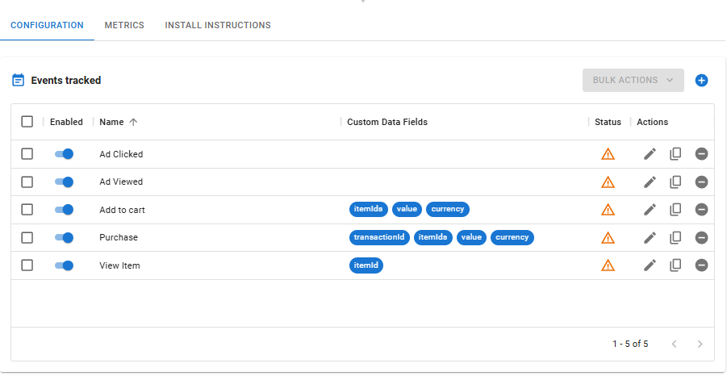

---
layout:
  width: default
  title:
    visible: true
  description:
    visible: false
  tableOfContents:
    visible: true
  outline:
    visible: true
  pagination:
    visible: true
  metadata:
    visible: true
---

# Rastreadores

Rastreadores são pequenos _scripts_ inseridos nos códigos do seu site para coletar dados sobre as atividades dos seus usuários. Em seguida, podemos usar os dados coletados para construir modelos de recomendação para executar campanhas de _retargeting_, melhorando suas conversões. Além disso, esses dados podem fornecer _insights_ valiosos sobre os interesses dos seus usuários, facilitando a criação de campanhas de anúncios mais eficientes.

## Gerenciando Rastreadores 

<figure><figcaption>
Lista de Rastreadores
</figcaption></figure>

### Criando um Rastreador 

Os rastreadores coletarão dados sobre as atividades do seu site, portanto, eles devem ser instalados e permanecer ativos por um tempo antes que seus dados possam ser usados para uma campanha.

1. Clique em  para começar a criar um rastreador.
2.  Preencha os detalhes:

    <figure><figcaption>
Editor de Rastreadores
</figcaption></figure>

    * Nome: defina um nome para o seu rastreador.
    * Tags: defina tags para sua organização.
    * Máximo de usuários: defina o número máximo de usuários que devem ser rastreados. Uma vez que o limite seja atingido, nenhum novo usuário será adicionado ao rastreador, mas os usuários já adicionados continuarão sendo rastreados.
    * Máximo de eventos por usuário: defina o número máximo de eventos por usuário a serem rastreados. Quando o limite for atingido, o recebimento de novos eventos fará com que os mais antigos expirem.
    * Idade máxima da atividade: defina o número de dias que os dados dos usuários rastreados serão armazenados. Após esse período, esses dados serão excluídos.
3. Clique em  para salvar seu rastreador.

### Editando um Rastreador 

Todos os parâmetros dos rastreadores são editáveis. Clique em .png>) na mesma linha do rastreador que deseja editar, faça suas alterações e, em seguida, clique em .png>) para salvá-las.

É possível arquivar rastreadores para uma melhor organização. Clique em .png>) para arquivar o rastreador selecionado. Visualize seus rastreadores arquivados ativando a chave seletora "Arquivado" acima da lista de rastreadores. Também é possível desarquivar um rastreador clicando em .png>).

### Excluindo um Rastreador 

Podemos também excluir nossos rastreadores clicando no botão de exclusão .png>) na mesma linha do rastreador que você deseja excluir e, em seguida, confirmando ao clicar em .png>). Esta ação não pode ser desfeita, então, por favor, tenha cuidado. Além disso, tenha em mente que os modelos de recomendação baseados no rastreador excluído podem parar de funcionar.


_Atenção! Tenha cuidado ao excluir rastreadores, esta ação não pode ser desfeita e todos os dados relacionados, incluindo métricas coletadas anteriormente, também serão excluídos._


## Gerenciando Eventos e Ações 

Configure eventos a serem rastreados e ações a serem executadas pelo rastreador quando o evento ocorrer.

<figure><figcaption>
Aba de Configuração de Rastreadores
</figcaption></figure>

### Criando Eventos e Ações 

Configure eventos de acordo com as atividades realizadas pelos usuários em seu site ou aplicativo, por exemplo, adicionar produtos ao carrinho, visualizar produtos, entre outros.

1. Na aba Configuração, clique em  para começar a criar um evento.
2.  Preencha as informações:\

    <figure><figcaption>
Editor de Eventos
</figcaption></figure>

    * Nome: Defina um nome para o seu evento.
    * ID do Evento: Defina um ID para o seu evento. Caso nenhum ID seja definido, o Nome do Evento será usado como ID padrão.
    * Campos de Dados Personalizados: Defina campos de dados personalizados a serem coletados quando o evento for capturado.
    * Moeda: Use este campo para especificar a referência de moeda para o evento. Isso deve refletir a moeda em uso em seu site. Ajuda a rastrear o valor monetário associado à ação do usuário.
    * Valor: Este campo captura a quantidade associada ao evento. Por exemplo, em um evento de compra, representa o número de produtos adquiridos em uma única transação. Declare uma variável em seu site que reflita essa quantidade.
    * ID de Deduplicação: Este campo é usado para atribuir um identificador exclusivo a cada instância de evento. Ele garante que eventos duplicados não sejam contados várias vezes, melhorando a confiabilidade dos dados.
    * Modelo: A opção de modelo está disponível para todos os campos acima. Ela define como os valores do evento serão processados. Aceita uma string utilizando variáveis dos campos de dados personalizados e gera uma saída separada por vírgulas.
3. Clique em .png>) para adicionar uma ação ao seu evento.
4. Preencha as informações:
   * Nome: Defina um nome para o sua ação.
   *   O que fazer?:

       <figure><figcaption>
Editor de Ações
</figcaption></figure>

       * Rastrear no Catálogo: Permite rastrear eventos com base em um catálogo de produtos.
         * Catálogo: Selecione o catálogo que deseja usar.
         * Rastrear como: Selecione como esta ação deve ser rastreada.
         * Campo Contendo IDs de Oferta: Selecione o campo personalizado que contém o ID da oferta ou use um _template_.
         * Template: Insira um _template_ específico que será usado para criar uma lista de IDs de oferta separada por vírgulas a ser rastreada.
         * Dados Personalizados Disponíveis: Os campos de dados personalizados configurados em seu evento serão exibidos aqui para ajudá-lo a construir um _template_.

       <figure><figcaption>
Editor de Ações
</figcaption></figure>

       * Rastrear no Identifier Pool: Esta opção permite adicionar ou remover identificadores de seus _pools_.
         * Identifier Pool: Selecione o identifier pool que você vinculará a esta ação.
         * Operação: Selecione se deseja adicionar ou remover identificadores do _pool._
5. Clique em  para salvar sua ação.
6. Sinta-se à vontade para adicionar mais ações a este evento e, quando terminar, clique em  para salvar seu evento.

### Editando Eventos e Ações 

Edite seus eventos e ações para atender às suas necessidades de negócio.

Podemos editar eventos clicando em .png>) na mesma linha do evento a ser editado na aba Configuração. Todos os parâmetros dos eventos estão disponíveis para edição. Após finalizar suas alterações, clique em .png>) para salvá-las.

Os parâmetros das ações também são editáveis. Você pode fazer isso encontrando o evento que contém a ação que deseja editar na aba Configuração, clicando em .png>) na mesma linha do evento e, em seguida, clicando em .png>) na mesma linha da ação a ser editada. Faça suas alterações e clique em .png>) para salvar suas alterações, depois clique em .png>) novamente para salvar suas alterações no evento, e pronto.

Também é possível duplicar eventos e ações clicando em .png>) na mesma linha do evento ou ação que precisa duplicar. Este recurso pode ser útil se você precisar criar uma nova ação ou evento, mantendo alguns parâmetros de um já existente.

### Excluindo Eventos e Ações 

É possível excluir eventos e ações clicando em .png>) na mesma linha do evento ou ação que precisa excluir e, em seguida, confirmar a ação clicando em .png>). Esta ação não pode ser desfeita, portanto, tenha cuidado ao fazê-la. Alternativamente, também é possível desabilitar eventos e ações mudando a posição da chave seletora de  para .png>) na mesma linha do evento ou ação que deseja desabilitar.

## Instruções de Instalação 

Após configurar eventos e ações para o seu rastreador, você deve instalá-lo em seu site. Isso pode ser feito seguindo as instruções na aba de instruções de instalação. Verifique nosso artigo de [Instruções de Instalação](install-instructions.md) para saber mais sobre nossos métodos de instalação.

## Aba de Métricas 

Após instalar seus rastreadores, você deve começar a receber dados deles. É possível acompanhar este processo na aba de métricas. Estas são as métricas disponíveis para rastreadores:

* [Contagem de Execução de Ação](../dmp-metrics.md#contagem-de-execucao-de-acao)
* [Taxa de Falha de Ação](../dmp-metrics.md#taxa-de-falha-de-acao)
* [Contagem de Expirações](../dmp-metrics.md#contagem-de-expiracoes-1)
* [Máximo de Usuários](../dmp-metrics.md#maximo-de-usuarios)
* [Contagem de Atividades](../dmp-metrics.md#contagem-de-expiracoes-1)
* [Tempo Até a Expiração](../dmp-metrics.md#tempo-ate-a-expiracao-1)
