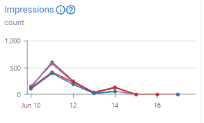
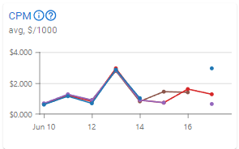
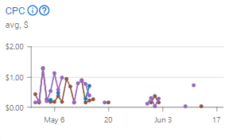

---
layout:
  width: default
  title:
    visible: true
  description:
    visible: false
  tableOfContents:
    visible: true
  outline:
    visible: true
  pagination:
    visible: true
  metadata:
    visible: true
---

# Métricas de DSP

## Métricas de Campanha 

Na seção de Campanhas, uma aba de métricas contendo dados está disponível, seguindo nosso padrão de métricas. Quando nenhuma de suas campanhas é selecionada, esta aba mostrará uma visão geral de todas as suas campanhas em nível de conta. Selecionar mais de uma campanha mostrará uma comparação entre as campanhas selecionadas, e selecionar apenas uma campanha habilitará o recurso "agrupar por" com quatro opções:

* **Campanha**: Esta opção exibirá todas as métricas disponíveis para a campanha selecionada.
* **Anúncio**: Esta opção exibirá uma comparação de dados entre os anúncios da campanha selecionada, permitindo que você colete informações sobre seu público. Essas informações podem ser usadas para criar anúncios mais envolventes no futuro.
* **Alvo**: Esta opção exibirá uma comparação de dados entre os públicos-alvo de sua campanha, permitindo que você colete informações sobre seu público. Essas informações podem ser usadas para configurar públicos-alvo mais precisos no futuro.
* **Exchange**: Esta opção exibirá uma comparação de dados entre as _ad exchanges_ usadas para veicular sua campanha, permitindo que você colete dados sobre qual _ad exchange_ tem sido mais eficaz para sua campanha.

Além disso, ao revisar as métricas, você sempre pode usar o   para acessar nossos artigos sobre uma métrica específica.


Você pode aprender mais sobre como as métricas são tratadas visitando a página de [Métricas](../metrics.md).


Abaixo você encontra todas as métricas pelas quais nosso produto DSP é responsável.

### Campanha Ativa 

Esta métrica indica se sua campanha esteve ativa ou não, e quando a campanha esteve ativa dentro do período de tempo selecionado.

<figure><figcaption>
Métrica de Campanha Ativa
</figcaption></figure>

_**Exemplo:** Neste gráfico, você pode observar que a campanha esteve ativa durante o período de 16 a 24 de junho. Esta métrica mostra resultados apenas quando uma campanha esteve ativa. Se não houver resultados nesta métrica, significa que a campanha estava desabilitada durante esse período._

### Lances e Taxa de Lances Ganhos % 

Isso representa o número de lances feitos em leilão. Não significa que você venceu o leilão, apenas que você fez um lance com base no seu preço de lance. A proporção de lances bem-sucedidos em relação ao total de lances feitos é uma métrica importante, pois será decisiva para saber quando aumentar seu preço de lance ou mudar sua estratégia. Esta métrica ajudará você a entender quantos lances você ganha.

<figure><figcaption>
Métrica de Lances
</figcaption></figure> <figure><figcaption>
Métrica de Taxa de Lances Ganhos %
</figcaption></figure>

_**Exemplo:** O gráfico mostra o volume de lances em uma campanha ao longo de seis dias (10-16 de junho). O número de lances varia consideravelmente, com o pico em 11 de junho (2.000 lances) e o número mais baixo em 14 de junho (menos de 500 lances). Em 16 de junho, o lance mais alto e o mais baixo são iguais. Você pode ver por essas métricas que nem todos os lances foram bem-sucedidos. Ao fazer mudanças estratégicas com base no preço do lance e nos públicos-alvo, você pode alcançar uma taxa de vitória mais alta. Pode ser que o público que você estava segmentando seja mais caro do que o lance definido._

### Preço do Lance Alvo 

Esta métrica mostra o preço do lance configurado para sua campanha. Existem três opções de visualização: mínimo, máximo e médio. O valor exibido é para 1.000 lances.

<figure><figcaption>
Métrica de Preço do Lance Alvo
</figcaption></figure>

_**Exemplo:** Neste gráfico, você pode observar que o preço médio do lance para esta campanha foi de $50 por lance para o período de tempo definido (17-24 de junho). Se você definir um preço de lance variável entre $0,0001 e $100, observará que esta métrica mostrará o preço do lance alvo; na visualização máxima, o cartão mostrará o valor máximo do lance, na mínima, mostrará o valor mínimo, e na média, o valor médio configurado para sua campanha._

### Preço do Lance Efetivo 

Esta métrica indica os preços colocados nos lances e mostra o quanto você está realmente pagando em cada leilão. Você pode fazer ajustes para gastar mais ou menos orçamento com base no quanto está pagando se estiver usando nosso preço de lance variável. Você pode verificar como nosso sistema de lances inteligentes está afetando seus custos.

<figure><figcaption>
Métrica de Preço do Lance Efetivo
</figcaption></figure>

_**Exemplo:** Você pode ver neste gráfico que o preço médio do lance variou de $0,50 a $1,00. Ao fazer lances em domínios não disputados, é provável que você pague um preço médio ou até mesmo o mínimo pelo leilão, em vez do máximo. No entanto, em domínios altamente disputados, pode ser necessário aumentar seu lance ou pagar perto do máximo. Isso é amplamente influenciado pelo preço atual do leilão. Nesta métrica, observamos que em alguns momentos, encontramos domínios ou configurações de público-alvo que exigiram preços de lance mais altos, resultando em um aumento de quase $1,00._

### Contagem de Dispositivos 

Esta métrica mostra o número de dispositivos únicos dos quais você recebeu uma impressão. Cada dispositivo é contado apenas uma vez.

<figure><figcaption>
Métrica de Contagem de Dispositivos
</figcaption></figure>

_**Exemplo:** Neste gráfico, você pode observar que o anúncio foi entregue a 4 dispositivos diferentes em 17 de junho, a 3 dispositivos em 18-19 de junho e a 1 dispositivo por dia até o final do período definido (17-24 de junho). Se um usuário dentro dos parâmetros do seu público-alvo recebe seus anúncios em seu PC, isso contará como um dispositivo único; se o mesmo usuário receber seus anúncios em seu smartphone, contará como outro dispositivo._

### Frequência por Dispositivo 

Esta métrica exibe quantas impressões seus anúncios recebem do mesmo dispositivo.

<figure><figcaption>
Métrica de Frequência por Dispositivo
</figcaption></figure>

_**Exemplo:** Um usuário dentro dos parâmetros do seu público-alvo pode ser impactado várias vezes pelo mesmo anúncio no mesmo dispositivo. Esta métrica conta quantas vezes o anúncio foi exibido no mesmo dispositivo. Neste gráfico, você pode observar que em 17 de junho, seu anúncio foi entregue ao mesmo dispositivo pouco mais de 10 vezes, enquanto em 18 de junho, esse número aumentou para cerca de 15 vezes por dispositivo._

### Impressões 

Após vencer um lance, você ganha o direito de publicar o anúncio no domínio onde fez o lance. Uma impressão se baseia no fato de um usuário ter seu anúncio baixado na página do domínio.

<figure><figcaption>
Métrica de Impressões
</figcaption></figure>

_**Exemplo:** O gráfico mostra o volume de impressões durante um período de seis dias (10-16 de junho). Houve um pico de quase 700 impressões em 11 de junho. Assim que você inicia sua campanha, se seus lances forem bem-sucedidos, você começará a receber impressões com base nos lances vencidos. Uma campanha focada em branding visa obter o maior número possível de impressões, já que seu objetivo é alcançar um público maior._

### Preço da Impressão 

Os preços pagos em lances bem-sucedidos. Saiba exatamente quanto você está pagando por um lance bem-sucedido.

<figure><figcaption>
Métrica de Preço da Impressão
</figcaption></figure>

_**Exemplo:** É útil saber quando a impressão está ficando cara. Nesta métrica, você pode ver que o preço da impressão atingiu $2,00. Isso pode acontecer quando os públicos-alvo não são amplos o suficiente, fazendo com que você gaste mais orçamento para obter 1000 impressões. Faça ajustes com base no objetivo de sua campanha. Se você está segmentando um público mais específico, o preço de sua impressão pode ser um pouco alto._

### **CPM**

Este é o custo por cada 1000 impressões. Pode servir como uma linha de base para saber se sua campanha está atingindo o CPM alvo. Com base em sua estratégia de CPM, note que o CPM não é o custo total de sua campanha. Para isso, você terá que verificar sua Métrica de Orçamento Gasto.

<figure><figcaption>
Métrica de CPM
</figcaption></figure>

_**Exemplo:** Neste gráfico, você pode ver que o CPM atingiu mais de $3,50 devido a uma mudança nos públicos-alvo. Se houver um público muito específico segmentado, pode ser necessário gastar um pouco mais para vencer lances em domínios disputados. Se você iniciar uma campanha de branding focada em atingir um máximo de $4,00 por 1000 impressões, precisará verificar se sua campanha está obtendo vitórias de lances suficientes para gerar impressões. Faça as alterações necessárias, como ajustar levemente seus públicos-alvo ou aumentar seu preço de lance._

### **CPC**

Esta métrica representa o orçamento gasto para cada clique. Muitas campanhas priorizam cliques, e o CPC indica o custo por clique. Se sua campanha enfatiza cliques, é essencial monitorar tanto o CPC quanto a métrica de Orçamento Gasto para determinar a eficácia geral e a eficiência de custo de sua campanha.

<figure><figcaption>
Métrica de CPC
</figcaption></figure>

_**Exemplo:** Nesta métrica, você pode observar que o custo por clique varia para cada anúncio, atingindo um máximo de quase $1,30. Essa flutuação pode ser influenciada por fatores como quando o anúncio é exibido, a janela de tempo que você está segmentando e se o criativo é atraente para o seu público-alvo._

### Custo por Carregamento de Página 

Esta métrica mostra uma mediana de quanto do seu orçamento foi gasto para cada página carregada.

<figure><figcaption>
Métrica de Custo por Carregamento de Página
</figcaption></figure>

_**Exemplo:** Após instalar a tag de rastreamento de carregamento de página, esta métrica mostrará uma mediana de quanto cada carregamento de página lhe custou no período de tempo definido. Nesta imagem, o período de tempo definido foi de 3 dias, dividido em períodos de 6 horas. Você notará que em 21 de agosto, às 12:00, o custo médio por carregamento de página foi de quase $1,60; este foi o custo máximo no período. Depois disso, há uma oscilação que permanece entre $0,50 e $1,50._

### Orçamento Disponível 

Esta métrica mostra quanto do seu orçamento ainda está disponível para uma campanha; ela mostrará novos valores à medida que o orçamento é gasto.

<figure><figcaption>
Métrica de Orçamento Disponível
</figcaption></figure>

_**Exemplo:** Neste gráfico, você pode ver que havia um orçamento diário de $30, que foi completamente gasto todos os dias de 21 a 24 de junho. Ao seguir esta métrica, você poderá observar quanto do seu orçamento permanece disponível para sua campanha._

### Limite de Orçamento Diário 

Esta métrica exibe o valor definido como o orçamento diário dentro do período de tempo especificado.

<figure><figcaption>
Métrica de Limite de Orçamento Diário
</figcaption></figure>

_**Exemplo:** Use os dados fornecidos nesta métrica para entender o limite de orçamento diário configurado no momento. Nesta imagem, o período definido foi de 3 dias, dividido em períodos de 6 horas. Você notará que o limite de orçamento diário configurado era de $10,00, e essa configuração permaneceu inalterada._

### Orçamento Gasto 

Representa o orçamento total gasto, incluindo compras de mídia, entrega de anúncios e atividades de lance. Este é o custo geral de execução de sua campanha. A campanha não se baseia apenas em seu preço de lance, que foi estabelecido quando a campanha foi criada.

<figure><figcaption>
Métrica de Orçamento Gasto
</figcaption></figure>

_**Exemplo:** Nesta métrica, você pode ver que o_ orçamento _gasto por anúncio não atingiu $1,00, uma vez que você estabeleceu nosso preço de lance abaixo de $1,00. Se você fizer quaisquer alterações durante a campanha, a métrica refletirá essas alterações._

### Ritmo de Orçamento Alvo 

Esta métrica mostra a meta de ritmo de orçamento definida. Ela ajuda você a planejar a taxa na qual seu orçamento será consumido.

<figure><figcaption>
Métrica de Ritmo de Orçamento Alvo
</figcaption></figure>

_**Exemplo:** Se você tem um orçamento diário de $10, esta métrica mostrará o ritmo em que este orçamento deve ser gasto ao longo de sua campanha. Neste gráfico, você pode observar que o orçamento diário estava abaixo de $5 de 16 a 23 de junho, e em 24 de junho, o orçamento diário aumentou para $15._

### Ritmo de Orçamento Efetivo 

Esta métrica mostra a taxa real na qual seu orçamento está sendo consumido. Ela permite que você colete informações sobre em que horas do dia ou dias da semana seus anúncios gastaram seu orçamento.

<figure><figcaption>
Métrica de Ritmo de Orçamento Efetivo
</figcaption></figure>

_**Exemplo:** Neste gráfico, você pode observar o ritmo do orçamento ajustado para gastar todo o orçamento definido para aquele período (21-24 de junho). A métrica de ritmo de orçamento efetivo mostrará como este orçamento está sendo gasto efetivamente e durante quais horas ou dias ele foi gasto._

### Orçamento Gasto em Impressões 

Esta métrica representa o orçamento total gasto em compras de mídia e reflete as despesas incorridas para adquirir espaços de anúncio.

<figure><figcaption>
Métrica de Orçamento Gasto em Impressões
</figcaption></figure>

_**Exemplo:** Neste gráfico, você pode ver que o orçamento gasto foi um pouco alto. No entanto, após fazer ajustes nos públicos-alvo, você alcançou uma média melhor, de mais de $0,75. É importante saber exatamente quanto você está gastando em impressões para otimizar seu orçamento de forma eficaz. As impressões são cruciais para campanhas de branding, pois ajudam a alcançar um público mais amplo ou a transmitir mensagens importantes._

### Orçamento Gasto em Entregas 

Esta métrica indica o orçamento total gasto no processo de entrega de anúncios, incluindo os custos associados à distribuição de anúncios para o público-alvo.

<figure><figcaption>
Métrica de Orçamento Gasto em Entregas
</figcaption></figure>

_**Exemplo:** Neste gráfico, você pode ver que a média alcançada ficou entre $0,15 e $0,35. É importante entender o valor que você está gastando em entregas, que é medido pela soma de impressões, entregas, exibições e visualizações. Isso o ajudará a determinar se as entregas estão atendendo aos objetivos de sua campanha e permitirá que você faça os ajustes necessários._

### Orçamento Gasto Realizando Lances 

Esta métrica mostra quanto do seu orçamento o motor de lances consumiu ao fazer lances por espaços de anúncio.

<figure><figcaption>
Métrica de Orçamento Gasto na Realização de Lances
</figcaption></figure>

_**Exemplo**: Quando você começa a executar uma campanha em nossa plataforma, o sistema começará a fazer lances de acordo com as configurações de sua campanha. Esta métrica mostra uma soma de quanto do seu orçamento foi consumido na realização de lances. Nesta imagem, você notará que o período definido foi de 1 semana, dividido em períodos diários; de 16 a 18 de outubro, o consumo relacionado à realização de lances foi de quase $0,50 por dia. Depois disso, você observará um aumento desse valor até quase $2,00 em 21 de outubro, e depois ele diminui novamente._

### Orçamento Gasto com Recomendações 

Esta métrica mostra quanto do seu orçamento foi gasto com base em recomendações. Ela só aparecerá se você estiver usando um modelo de recomendação para esta campanha.

<figure><figcaption>
Métrica de Orçamento Gasto com Recomendações
</figcaption></figure>

_**Exemplo**: Em um contexto onde você tem uma campanha de retargeting projetada para engajar usuários em seu site, o orçamento alocado para recomendar produtos de seu catálogo a esses usuários é mostrado na métrica "Orçamento gasto com recomendações". O gráfico exibe um período de uma semana, com cada ponto correspondendo a um dia e ao orçamento gasto com recomendações. Você pode ver que em 24 de junho, o orçamento gasto com recomendações foi de quase $0,07, com uma queda considerável em 28 de junho._
