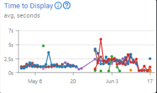

# Ad Server Metrics

Here you will find all metrics related to our Ad Server product, they will appear according to each feature, it will help you understand how the feature is performing and provide valuable insights to make strategic decisions on your campaign. Additionally, when reviewing metrics, you can always use the   to access our articles about a specific metric.


You can learn more about how metrics are handled by visiting the [Metrics page](../metrics.md).


### **Deliveries and Delivery Rate**

This metric represents the number of ads served from the Ad Server, based on the end user's browser requesting the content. This means your ad will be in the user's browser.

<figure><figcaption>
Deliveries Metric
</figcaption></figure> <figure><figcaption>
Deliveries % Metric
</figcaption></figure>

_**Example:** In this graph, you can see that a peak of almost 700 deliveries was reached, with an average delivery rate of 100%. This means your ads are being delivered to the correct audience without any restrictions on their domain. The Delivery metric is often related to the Impressions metric. After winning a bid, your ad will be served to the domain. However, if your delivery does not get a similar result as the impressions, it may be caused by the domain's rules, towards blocking some specific kind of Ads._

### **Displays and Display Rate**

This metric represents the number of ads displayed in a browser. It indicates that the ad has been downloaded and shown to the user's browser.

<figure><figcaption>
Displays Metric
</figcaption></figure> <figure><figcaption>
Display % Metric
</figcaption></figure>

_**Example:** In this graph, you can see that a peak of nearly 650 Displays was reached. Even though your impression numbers are a bit higher, the display rate is not reaching 100%. This can be caused by the ad not being positioned well enough, causing the user to not see the ad for even a fraction of their browsing routine. Making changes to the positioning and making the creative more attractive can increase the display rate of your ads._

### **Views**

Number of views according to the **Media Ratings Council Guidelines**, 50% of the ad must be on screen for at least 1 second. This metric is only validated once the user meets the **MRCG** requirements.

<figure><figcaption>
Views Metric
</figcaption></figure>

_**Example:** In this graph, a peak of nearly 400 Views can be seen on June 11th. If the views are close to the delivery and display numbers, you can analyze that your Ad is attractive and is achieving a branding result, since people are effectively seeing your ad. The ad must be displayed in the user's browser, and the user needs to see at least 50% of the ad for at least 1 second.  If only  40% of the ad is shown, it will not count as a view._

### **Viewability**

The ratio of views to the total number of deliveries is an important metric to measure if your ads are being viewed. Based on this, you might need to change your campaign's strategy.

<figure><figcaption>
Viewability Metric
</figcaption></figure>

_**Example:** You can see in this graph that the campaign started with an average viewability of 50% to 80%, and after some changes, reached a peak of 100% viewability. If your ads are not being viewed, you might need to check your creative and make changes, or even change the positioning of your ads to make them more visible. Keep in mind that changing the positioning can also increase the bidding price due to the spot being more competitive._

### **Clicks and CTR**

Number of clicks. If your campaign's strategy is based on clicks, pay attention to this metric and make the necessary adjustments.

<figure><figcaption>
Clicks Metric
</figcaption></figure> <figure><figcaption>
CTR Metric
</figcaption></figure>

_**Example:** In this graph, you can see that a peak of almost 10 clicks was reached on certain ads. You can review this chart to identify which ads are not receiving the expected clicks and analyze how they differ from the ads that were clicked on, you also have to consider the used targets to understand in what audience your ads are performing better. A campaign based on Retargeting or Remarketing focuses on clicks to generate conversions. To achieve this, you need to create compelling creatives and may need to allocate a larger budget to ensure better positioning and target more specific audiences._

### **Time to Display**

This metric measures the time it takes for the ad to load and be displayed. If your ad is too heavy, it might encounter difficulties loading on weaker devices or slower internet connections.

<figure><figcaption>
Time to Display
</figcaption></figure>

_**Example:** You can see on this graph that some ads are on average taking over 3 seconds to load. If your ad is heavier or close to 2 MB, some users may experience longer loading times, resulting in delays before your ad appears. This can impact directly the visibility of your ad, potentially causing users to miss it during their browsing activities, optimizing your creative might help._

### **Time to View**

This metric measures the time it takes for a user to view the ad. By examining this metric, you can assess whether adjustments are needed regarding the placement of your ad. If users are taking too long to view your ad, it might be poorly positioned.

<figure><figcaption>
Time to View Metric
</figcaption></figure>

_**Example:** In this metric, you can see that at the beginning of the campaign, the ads were being viewed much more quickly, largely due to their positioning. However, after some changes, the ads were taking significantly longer than intended, often extending beyond an additional 15 to 20 seconds. An ad displayed at the top of a page is much more visible than one on a side panel, which may require scrolling to view. As a result, changing the positioning of your ad will directly impact the time it takes for users to view it._

### **Time to Click**

This metric measures the time it takes for a user to click on the ad. If users take too long to click, it could indicate that the ad is misplaced or not as attractive as expected. Consider making changes to enhance the attractiveness of your ad or adjusting its positioning.

<figure><figcaption>
Time to Click Metric
</figcaption></figure>

_**Example:** In this metric, you can observe that, on average, users take 1 minute and 30 seconds before clicking on an ad. If the ad is taking too long to be clicked, you should pay attention to the quality of your creative. It might be better to identify areas for improvement. Additionally, you can also use A/B Tests to assess the performance of each Ad and make multiple improvements in each test to reach a final version of that creative that gets more results. Keep monitoring your ads and make constant adjustments._

### Time To Page Load

This metric shows a median in seconds of how much time was taken until your website's page was fully loaded.

<figure><figcaption>
Time To Page Load
</figcaption></figure>

_**Example**: These metrics provide information on how much time it takes until your page loads, you can use this data to improve your ads and your website to be faster, which can improve your retention rate. In this picture, the defined time frame was 3 days, divided into 6-hour periods, you will notice that on Aug 21, the time to load the page was nearly 10 seconds, after that, this time was reduced to nearly 5 seconds and then increased to a little more than 10 seconds on Aug 23._

### Page Loads

This metric displays the number of page loads you had in the defined time frame. The number of clicks and page loads may differ because clicks pass through an anti-fraud filter. A click might be flagged as suspicious and not counted, however, if the page loads up to 15 minutes after the ad delivery, the page load will be counted.

<figure><figcaption>
Page Loads
</figcaption></figure>

_**Example**: This is a more precise way to count how many users visited your page by clicking on your ads, the user will only be counted after loading your page completely. In this picture, the defined time frame was 3 days, divided into 6-hour periods, you will notice that on Aug 21 there were nearly 25 page loads and nearly 5 page loads on Aug 23._

### Page Load Rate (%)

This metric shows the ratio of pages loaded to ad delivery, which means that it shows, in percentage, how much of your ad deliveries resulted in a page load.

<figure><figcaption>
Page Load Rate %
</figcaption></figure>

_**Example**: In a context where you install the page load tracking tag on your website, you will be able to follow on this metric how much of your ad deliveries resulted in users accessing your website. In this picture, the defined time frame was 3 days, divided into 6-hour periods, you will notice that on Aug 21 nearly 0.75% of the ad deliveries resulted in a page load, and after that, on Aug 23, the page load rate was almost 0.25%._

### Click to Page Load Rate

This metric displays, in percentage, the ratio between the number of clicks and the number of page loads in the defined time frame.

<figure><figcaption>
Click to Page Load Rate
</figcaption></figure>

_**Example**: The data provided by this metric will show you how many clicks on your ads have resulted in a page load. In this picture, the defined time frame was 1 day divided into 6h periods, you will notice that at 6 AM the click to page load rate was nearly 80%, meaning that 20% of the clicks didn't result in a page load, from noon until 6 PM the click to page load rate was nearly 60%, after that it increases at midnight to 100%, meaning every ad click resulted in a page load._&#x20;
