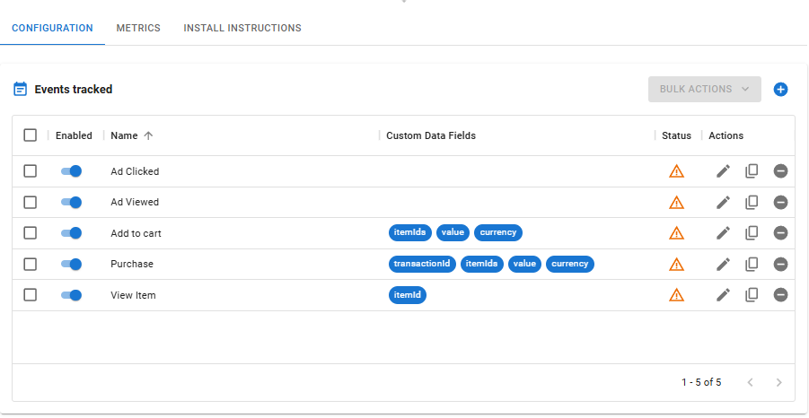

# Creative Groups

Creative Groups, as the name suggest, allow you to group several creatives while applying different weights to each.

This is most useful to run A/B tests with any number of creatives to measure which performs better.&#x20;

## Managing Creative Groups

<figure><figcaption>
Creative Group list
</figcaption></figure>

### Creating a Creative Group

1. In the Creative Group page click at the CREATE CREATIVE button.
2.  Fill the details:

    <figure><figcaption>
Creative Group editor screen
</figcaption></figure>

    * Name - how you want to call this creative group;
    * Tags - up to 5 labels that can be used to aid identification and searching;
    * Domain - this is the primary domain that the creatives on this group will take the user when clicked;
    * Type - the type of creative, can be any common IAB size like "Large Leaderboard (970x90)", "Banner (468x60)", etc.
3.  Configure the creative group composition:

    <figure><figcaption>
Creative Group composition
</figcaption></figure>

    1. Select at least one creative to be a part of this group. To add more creatives use the ADD button. To remove an existing creative use the REMOVE button.
    2.

        <figure><figcaption></figcaption></figure>
    3. By default the system will attribute equal weight to all creatives. If you wish to direct more traffic to one creative over another, simply adjust the weights column. The system will calculate what is the approximate ratio of impressions that each one will have.
    4. Click on the PREVIEW button to see a preview of this group.
4. If all is correct, click on the SAVE button.

### Editing a Creative Group

To edit a creative group use the  button on the creative group list. All fields are available for editing except the domain and type selectors.

### Archiving and Unarchiving a Creative Group

Creative Groups that are not being used as often can be archived by clicking on the  button. Archiving a creative group does not prevent it from being used or displayed, just hides it from main view.

To see all archived creative groups simply turn on the  filter. You can unarchive  a creative group to make it show again on the main list.

### Deleting a Creative Group

You can delete a creative group by clicking on . If the creative group is being used, you will be presented with a list of ads that will be affected. If you confirm the deletion, the ads will be modified to remove the deleted creative group from rotation.

<figure><figcaption>
Delete confirmation screen showing that the creative group is being used.
</figcaption></figure>

## Monitoring Creative Groups

### Metrics Tab

The metrics tab will display all metrics related to the selected creative groups or for the whole account if no creative groups are selected.

Learn more about the [metrics tab](../monitoring/metrics-tab.md).

### Real Time Tab

The real time tab will display real time events related to the selected creative group.

Learn more about the [real time tab](../monitoring/real-time-tab.md).

