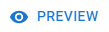

---
layout:
  title:
    visible: true
  description:
    visible: false
  tableOfContents:
    visible: true
  outline:
    visible: true
  pagination:
    visible: true
---

# Creatives

Creatives are the smallest building block of our Ad Server, representing what will be delivered to the end-user when your ad is displayed.

Display Creatives are essentially just blocks of HTML code. You can provide this code yourself or utilize our built-in editor to configure a simple creative that has a clickable image.

## Managing Creatives

<figure><figcaption>
Creative list
</figcaption></figure>

## Creating a Creative

To start creating your creative, click on .

Fill in the details:

<figure><figcaption></figcaption></figure>

* Name - how you want to call this creative;
* Tags - up to 5 labels that can be used to aid identification and searching;
* Domain - the primary domain to which this creative will direct the user when clicked;
* Type - the type of creative, such as common IAB size like "Large Leaderboard (970x90)", "Banner (468x60)", etc.

To design your creative, you have two options:

### Static Image

* To use a simple image with a link, on the "Static Image" tab, fill in:
  * The image you wish to display. You can either paste a URL for an image you are already hosting or use the integration with the BMS Media Library to find or upload a new one.
    * Note: The BMS Media Library supports uploads of static images or GIFs as long as the file size is 2 MB or less.
  * The link you wish to open when the image is clicked. This can be any HTTPS URL with query strings such as UTMs. Our standard click tracker will be added to show metrics for the creative.

### Editing UTMs

When inserting the link to the website designated for your creative, it is important to set your UTM tags. If you do not have your tags pre-created, you can use the  feature to make adjustments to your URL and check a preview in real time to validate your URL. This button can be found in the space named "Link to." After clicking the button, the UTM tag configuration screen will pop up.

<figure><figcaption>
UTM Editor
</figcaption></figure>

You will be presented with your current website URL and then each UTM tag and its explanation to help you complete them.


If no URL has been informed, you will **need** to insert the corresponding **URL** to your website's domain, if no URL is presented it will not be possible to configure your UTM's.


When editing UTMs, every time you change a tag, it will automatically update your Link URL, presenting you with the current version of your tags.

*   **UTM Source:** Identifies the source of the traffic. In this case, you would use "BMS" as your source.&#x20;

    * **Example - "BMS"**: To know that the creative has come from the BMS platform.

    **Note:** You can add any kind of source to your UTM, it is up to you to decide with one is better.
* **UTM Medium:** You can use a campaign medium to identify the medium a visitor found your URL on, such as social media, QR code, cost-per-click (CPC), affiliates, organic/paid ads, newsletters, etc.&#x20;
  * **Example - "Social":** Since the campaign will target social media, we can set the medium as Social.
* **UTM Campaign:** As the name suggests, it is used to give a name to your campaign, like "Black Friday Sale," "Thanksgiving Sale," "Launch Campaign," etc.&#x20;
  * **Example - "YourCampaign":** Here you can simply state the name of your campaign, to better identify the campaign that the creative is being used.
* **UTM Content:** Campaign content is useful when you are A/B testing ads. It differentiates identical links that direct to the same URL. For example, when you have two links in one email, this parameter distinguishes between them.
  * **Example - "HomePage":** The content that the user will be presented to, if we are running A/B Tests on different pages, this is a way of configuring the content UTM Tag.
* **UTM Term:** Identifies paid keywords in ad campaigns (mainly used for paid search campaigns).
  * **Example - "Sport Shoes":** This identifies the paid search campaign in which the keywords used for the paid search were Sport Shoes.

Once you configure all of your UTM Tags, hit the  button, and your tags will be configured accordingly.

<figure><figcaption>
UTM Tags Configured
</figcaption></figure>

### Paste HTML

* To use a fully customized creative, switch to the "Paste HTML" tab and insert the final HTML code that will be displayed when the user views your creative.

<figure><figcaption>
HTML Code Customization Example
</figcaption></figure>

* This can be anything and it is entirely up to you to produce a working creative with HTML, CSS, and Javascript.
* When you provide the HTML code, our click tracker won't be automatically added. You can copy the click tracker macro (or any other macro you wish) from the bottom template assist buttons and paste it on your HTML. For more information, please take a look at the [Macros section](creatives.md#macros).

You can use the  button to see how your creative will be displayed and to make sure that it directs users to the correct site when clicked.

If you are ready to send the creative for review ensure that the "Send for review" option is checked. If you wish to continue editing it later, leave it unchecked.

After making all necessary adjustments, click on  (1) (1) (1) (1) (1) (1).png>).

#### Macros

Our Ad Server provides several macros that can be used within your HTML code. They are:

* BMS Click Tracker - these macros will enable BMS to track clicks on your ads. If you don't install any of these, no click event or metric will be registered.
  * \
    This is the most used version. It must be installed at the very beginning of the link, before any other tracker, and before the final URL itself.
  * \
    This version is similar to the previous but it should only be used if you wish to have an external click tracker that does not support unescaped URLs.
  * \
    This version is similar to the previous two but it should only be used if you wish to have a click tracker chain of two or more where the external click tackers do not support unescaped URLs.
* \
  This macro will inject a random sequence of numbers and is most commonly used to ensure that the requests will not be cached.

### Editing a Creative

To edit a creative use the  button on the corresponding creative. All fields are available for editing except the domain and type selectors.

<figure><figcaption>
Editing a Creative
</figcaption></figure>

If you modify the image URL, link or the HTML code the creative will go back to the  status and you will need to send the creative for review again. While in draft, the creative will not be shown on any campaigns.

Once you have made all necessary changes to your creative, click on  (1) (1) (1) (1) (1) (1).png>).

### Enabling and Disabling a Creative

 (1) (1) (1) (1).png>)

In order to be displayed in a campaign, a creative must be enabled. If you wish to prevent a creative from being displayed, you can disable it, and it will immediately cease impressions.

### Archiving and Unarchiving a Creative

Creatives that are not being used frequently can be archived by clicking on the  button. Archiving a creative does not prevent it from being used or displayed; it simply hides it from the main view.

To view all archived creatives, simply turn on the  filter. You can unarchive  a creative to return it to the main list.

### Deleting a Creative

You can delete a creative by clicking on . If the creative is being used, you will be presented with a list of creative groups that will be affected. If you confirm the deletion, the creative groups will be modified to remove the deleted creative from the rotation.

<figure><figcaption>
Delete confirmation screen showing that the creative is being used.
</figcaption></figure>


Attention! If you delete a creative, all data related to that creative, including previously collected metrics, will also be deleted, this action cannot be undone.


## Monitoring Creatives

### Metrics Tab

The metrics tab will display all metrics related to the selected creatives or for the whole account if no creatives are selected.

Learn more about the [Metrics tab](../ad-server/ad-server-metrics/creatives-metrics.md).

### Real Time Tab

The real time tab will display real time events related to the selected creative.

Learn more about the [Real Time tab](../demand-side-platform-dsp/real-time-tab.md).

