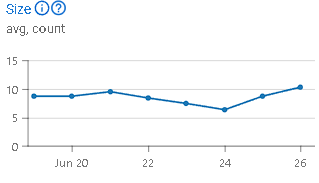

---
layout:
  title:
    visible: true
  description:
    visible: false
  tableOfContents:
    visible: true
  outline:
    visible: true
  pagination:
    visible: true
---

# Cookie Pools Metrics


You can learn more about how metrics are handled by visiting the [Metrics page](../../metrics.md).&#x20;


Select a cookie pool from the list to access its metrics. It is also possible to select more than one to compare their results.

<figure><figcaption>
Cookie Pools Metrics Tab
</figcaption></figure>

### **Expiration Count**

This metric displays how many cookies have expired within the configured time frame. Cookies expire based on the TTL, which is the number of days after which a cookie will expire, configured when creating the cookie pool.

<figure><figcaption>
Expiration Count Metric
</figcaption></figure>

_**Example:** You create a cookie pool with a TTL of seven days and install it on your homepage. The cookies generated by your users' access will be available for targeting for seven days. After this period, the cookies will expire. This means that in a retargeting campaign, for example, you will impact users who visited your website in the last seven days. In this graph, you can observe that on June 19th, just under 5 cookies expired, on June 20th no cookies expired, and on June 21st just under 5 cookies expired, and so on._

### **Max Size**

This metric shows the maximum amount of cookies allowed in the pool as configured.

<figure><figcaption>
Max Size Metric
</figcaption></figure>

_**Example:** When creating or editing a cookie pool, you can set the maximum amount of cookies in the pool. This will limit the total number of cookies your pool can contain. In this graph, you can observe that a maximum size of 100,000 cookies was defined for this cookie pool._

### **Size**

This metric shows the actual size of the pool, meaning it will show how many cookies are or were in the pool within the configured time frame.

<figure><figcaption>
Size Metric
</figcaption></figure>

_**Example:** On this graph, you can observe the size of a cookie pool in the defined time frame. This metric can be used for gathering knowledge about how many cookies are generated within the configured time frame, which will allow you to set a maximum size for the pool that is in the same range as the number of users on your website._

### **Sync Count**

This metric shows the number of cookie synchronizations, meaning it shows when a collected cookie has been synchronized with our platform and later with the exchanges as well, which allows you to target users more precisely.

<figure><figcaption>
Sync Count
</figcaption></figure>

_**Example:** On this graph, you can observe the number of synchronizations that happened in a defined time frame. When a user accesses your website, a cookie will be requested for him, after receiving this cookie, it will be analyzed if this user already has a cookie or not, if he does the new cookie will be synchronized with the already existing one, updating its data on the platform, if he doesn't a cookie will be created for him on the platform._

### **Time Until Expiration**

This metric shows the median remaining time a cookie is still available in the pool until expiring in the determined time frame.

<figure><figcaption>
Time Until Expiration
</figcaption></figure>

_**Example:** When you create your cookie pool you can set the number of days in which a cookie will expire, this metric shows you how much time you have until a cookie expiration. On this graph, the time frame was 1 week, divided into daily periods, represented as dots, you can observe that on June 20th there was less than 1 day until some of the cookies in the pool expired._

### Additional Information

These are all the metrics available in the Cookie Pool feature for analyzing the performance of your cookie pools. Additionally, when checking metrics, you can always check our  to access for more information about a specific metric.
