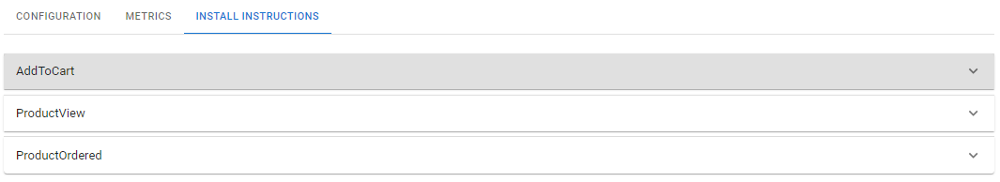
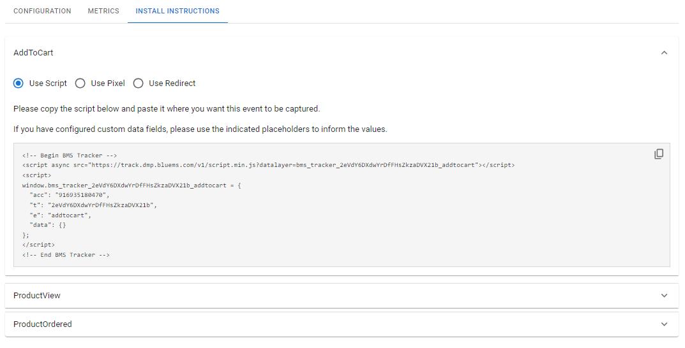

# Trackers

Trackers are small scripts placed on your websites' codes to gather data on your users' activities, then we can use the collected data to build recommendation models for running retargeting campaigns, improving your conversions. Additionally, this data can provide valuable insights into your users' interests, facilitating the creation of more efficient ad campaigns.

## Managing Trackers

<figure><figcaption>
Trackers list
</figcaption></figure>

### Creating a Tracker

Trackers will gather data about your website's activities, so it must be installed and active for a while before their data can be used for a campaign.

1. Click on  to start creating a tracker.
2. Fill in the details:
   * Name: set a name for your tracker.
   * Tags: set tags for your organization.
   * Maximum users: set the maximum number of users that should be tracked, once the limit is reached, no more new users will be added to the tracker, but the users added will still be tracked.
   * Maximum events per user: set the maximum number of events per user to keep track, once the limit is reached, receiving new events will cause the oldest ones to be expired.
   * Maximum activity age: set the number of days for the tracked users' data to be stored, after this period this data will be deleted.
3. Click on  to save your tracker.

### Editing a Tracker

All the trackers' parameters are editable, click on .png>) in the same row of the tracker you want to edit, make your changes, then click on  to save them.

It's possible to archive trackers for your better organization. Click on .png>) to archive the selected tracker, visualize your archived trackers by turning on the switch "Archived" above the trackers' list. It is also possible to unarchive a tracker by clicking on .png>).

### Deleting a Tracker


Attention! Be careful when deleting trackers, this action cannot be undone and all the related data, including previously collected metrics, will also be deleted.


We can also delete our trackers by clicking on the delete button .png>) in the same row as the tracker you want to delete, then confirming it by clicking on . This action cannot be undone, so please be careful. Additionally, keep in mind that recommendation models based on the deleted tracker might stop working.

## Managing Events and Actions

Configure events to be tracked and actions to be performed by the tracker when the event happens.

<figure><figcaption>
Trackers' Configuration Tab
</figcaption></figure>

### Creating Events and Actions

Configure events according to the activities performed by user on your website, for example adding products to the cart, viewing products, and others.

1. On the Configuration tab, click on  to start creating an event.
2. Fill in the details:
   * Name: Set a name for your event.
   * Event ID: This field can be customized to set a different event ID, however, it is automatically filled with the event's name.
   * Custom Data Fields: Set data fields to be collected when the event is captured.
3. Click on .png>) to add an action to your event.
4. Fill in the details:
   * Name: Set a name for your action.
   * What to do?:
     * Track In Catalog: Allows you to track events based on a product catalog.
       * Catalog: Select the catalog you desire to use.
       * Track as: Select as this action must be tracked.
       * Field Containing Offer IDs: Select the custom field that contains the offer ID or use a template.
       * Template: Insert a specific template that will be used to create a comma-separated list of offer IDs to be tracked.
       * Available Custom Data: Custom data fields configured on your event will be displayed here to help you build a template.
5. Click on  to save your action.
6. Feel free to add more actions to this event, and when you're done, click on  to save your event.

### Editing Events and Actions

Edit your events and actions to meet your business needs.

We can edit events by clicking on .png>) at the same row of the event to be edited on the Configuration tab,  all events' parameters are available to be edited, after finishing your changes, click on  to save them.

Actions' parameters are also editable, you can do this by finding the event that contains the action you want to edit on the Configuration tab, clicking on .png>) at the same row of the event, and then clicking on .png>) at the same row of the action to be edited, make your changes and click on  to save your changes, then click on  again to save your changes to the event, and you're done.

It's also possible to duplicate events and actions by clicking on .png>) at the same row of the event or action you need to duplicate, this feature can be useful if you need to create a new action or event while keeping some parameters of an existing one.

### Deleting Events and Actions

It's possible to delete events and actions by clicking on .png>) at the same row of the event or action that you need to delete, then confirm the action by clicking on . This action cannot be undone, so be careful when doing it. Alternatively, it's also possible to disable events and actions by changing the switch position from on  to off.png>) in the same row of the event or action you want to disable.

## Install Instructions

After setting up events and actions for your tracker you have to install the tracker on your website, this can be done by following the instructions on the install instructions tab.&#x20;

<figure><figcaption>
Install Instructions Tab
</figcaption></figure>

To access the trackers' instructions tab, select the tracker you need to install in the trackers'  list, to use this tab you must select only 1 tracker at a time. The tab will contain one section for each event created for the selected tracker.

### Installing an Event Tracker

There are 3 install methods available for this feature: Script, Pixel and Redirect. You can choose from these options after you expand the section of the event you want to install.

<figure><figcaption>
Event section - Script Install Method
</figcaption></figure>

#### Using Script Method

1. Select the Script option.
2. Use the copy button .png>) to copy the script displayed.
3. If you have configured custom data fields, use the indicated placeholder to inform the values.
4. Install it on your website where you want this event to be captured.

#### Using Pixel Method

1. Select the Pixel option.
2. Use the copy button .png>) to copy the image tag displayed.
3. If you have configured custom data fields, use the indicated placeholder to inform the values.
4. Install it on your website on the page you want this event to be captured.

#### Using Redirect Method

1. Select the Redirect option.
2. Inform the URL to where you want to redirect the user to after the event is captured.
3. Use the copy button .png>) to copy the displayed URL.
4. Use the generated URL just as you would use the URL you provided.

After installing your events' trackers you should start receiving data from them, it's possible to follow this process on the metrics tab.&#x20;
