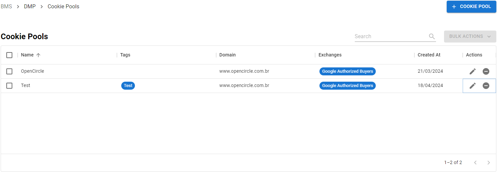

---
layout:
  title:
    visible: true
  description:
    visible: false
  tableOfContents:
    visible: true
  outline:
    visible: true
  pagination:
    visible: true
---

# Event Stores

In our Event Stores tab, you can create a store that acts as a database for storing events. You will be able to create a store where your event pipes will be sent. You can then download the events as a JSON file and import that to your data management file to organize it better.

<figure><figcaption>
Event Stores Tab
</figcaption></figure>

## Creating an Event Store

To create an event store, click on .png>) then an event creation screen will pop up.

<figure><figcaption>
Event Store Creation
</figcaption></figure>

* Name - Set a name for your Event Store.
* Tags - Create tags to better identify each event store.
* Retention - Decide for how long you will be keeping the data collected by this event store, after expiration, the data will be **deleted**.

After configuring your event store, click on  button to finish your event creation.

### Enabling your Event Store

To enable an event store simply flip the toggle  and your event store will be enabled.

<figure><figcaption>
Event Store Enabled
</figcaption></figure>

### Editing your Event Store

To edit your event store, click on  and an editing screen will pop up, make the necessary changes, and then click on .

<figure><figcaption>
Edit Event Store Screen
</figcaption></figure>

### Bulk Actions

When selecting two or more event stores, the Bulk Actions will be enabled, allowing you to make actions in bulk.

You will be capable of Archiving, Deleting, Enabling, and Disabling events in bulk.

<figure><figcaption>
Event Stores' Bulk Actions
</figcaption></figure>

### Archiving and Unarchiving your Event Store

To archive your event store, click on  and your event store will be sent to the archived list. In order to unarchive your event store, switch your view to archived events by flipping the toggle . You will then be presented with the list of archived events. Click on  to unarchive an event store.

### Deleting your Event Store

To delete an event store, click on  and a confirmation screen will pop up.

<figure><figcaption>
Deletion Screen
</figcaption></figure>

To confirm your deletion click on .png>).


_Attention! If you delete an event store, all data related to that event store will be deleted._


## Event Streams

Once you create your event stores and pipes, all triggered events will be presented on your Event Streams tab, being available for download according to your data retention settings.

These data will **only** be displayed if there is an event pipe sending data to an event store.

<figure><figcaption>
Event Streams Tab
</figcaption></figure>

### Downloading your Event Streams

You are able to download your event streams by clicking on  (11).png>) at the same row as the event stream you want to download. There are two formats of files available:

#### JSON-line

The JSON-line format offers a raw and unfiltered view of the event stream, capturing all relevant information as events occur. This format ensures that no data is left out, giving you complete visibility into each transaction for detailed analysis or integration into custom workflows.

<figure><figcaption>
JSON-line
</figcaption></figure>

Select this format and then click on .png>) to download your event stream.

#### CSV

The CSV format provides a customizable and organized view of the event stream, enabling you to choose specific data fields for export. This format makes the data easier to analyze in spreadsheet applications or reporting tools while retaining essential information needed for insights into advertising performance and activity.

<figure><figcaption>
CSV
</figcaption></figure>

It is possible to add or remove columns to your CSV file. To add a column click on , and then fill in the details:

<figure><figcaption>
Add Column
</figcaption></figure>

* Label - Inform the desired label for the column
* Read Data From - Inform the parameter from where you want to read data
* Default Value - Fill this with a default value for the column, this field is optional.

To remove a column, select it in the list and then click at  (11).png>).

After finishing your settings, click on .png>) to download your CSV file.

### Bulk Actions

You can select multiple event streams by checking the , after selecting more than one event, the bulk options will enable, you can download the selected event streams by clicking on , and selecting one of the file formats available.

It's also possible to bulk delete your event streams, click on , then select delete, and confirm the deletion when it is asked.

### Deleting Event Streams

To delete an event, click on .png>) and a confirmation will be required.

<figure><figcaption>
Event Deletion
</figcaption></figure>

After clicking on .png>), your event data will be permanently deleted.


_Attention! Be careful when deleting event streams, this action cannot be undone, meaning, your data is permanently removed._

